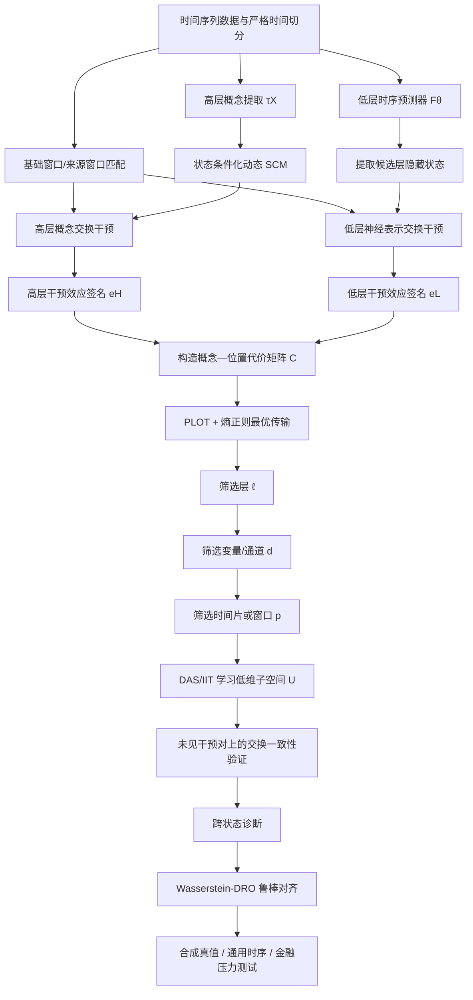

# TARCA 项目汇报书

> **项目名称**：TARCA——面向状态切换的时序因果抽象与分布鲁棒机制定位
> **项目定位**：通用时间序列机制解释方法，金融序列作为高非平稳、高噪声压力测试场景
---

## 0. 汇报摘要

> 这个项目不是再训练一个“更会预测股票”的模型，而是研究一个已经训练好的时序模型内部究竟在用什么机制做预测、这些机制藏在哪里，以及换到新的市场状态后，这套解释是否仍然可信。

TARCA 的核心任务是对一个已训练的多变量时序预测器 $F_\theta$ 进行**可干预的机制解释**。项目首先构造一个由趋势、波动、冲击、跨变量传播等概念组成的高层动态结构因果模型；随后对高层概念和低层神经表示分别做交换干预，比较两者对多步概率预测造成的影响。若高层概念干预与某个神经位置的内部干预在未见样本上持续产生近似相同的预测变化，则认为该高层概念与模型内部机制之间形成了受限的因果抽象。

项目的三条核心研究主线为：
$$
\text{RQ1：机制是否存在}
\;\longrightarrow\;
\text{RQ2：机制位于哪里}
\;\longrightarrow\;
\text{RQ3：机制解释能否跨状态泛化}
$$

具体而言：

- **RQ1** 验证高层概念干预与低层内部干预是否具有一致的预测效应；
- **RQ2** 使用渐进式 PLOT 与最优传输，从层、变量/通道、时间片逐步定位候选区域，再使用 DAS/IIT 学习低维概念子空间；
- **RQ3** 在不针对测试状态重新拟合解释器的前提下，研究训练环境中学习到的概念子空间能否在未见状态中保持干预保真度，并使用 Wasserstein 分布鲁棒优化降低最坏合理环境中的抽象误差；

本项目的核心产出不是“动量一定导致未来上涨”之类的真实市场因果结论，而是：

> 在给定高层概念模型和受控内部干预定义下，证明某些神经表示对模型预测所承担的计算作用，与指定的高层概念机制近似一致。

---

# 1. 项目整体架构

## 1.1 总体流程图

> 整个系统有两条并行路径：一条让简单的概念模型回答“改动量后预测应该怎样变”，另一条直接修改深度模型内部表示，观察模型预测怎样变；随后比较两种变化，并逐步找到真正对应概念的内部位置。

## 1.2 架构分层说明

| 架构层    | 主要内容                        | 核心输出             |
| ------ | --------------------------- | ---------------- |
| 数据与协议层 | 时间切分、状态定义、概念提取、泄漏检查         | 可审计样本与干预对        |
| 低层预测层  | PatchTST、iTransformer 等预测器  | 多步概率预测与隐藏状态      |
| 高层概念层  | 趋势、波动、冲击、传播等动态 SCM          | 高层概念干预后的目标效应     |
| 干预与定位层 | 时序交换干预、效应签名、PLOT、OT、DAS/IIT | $s=(\ell,d,p,U)$ |
| 鲁棒性层   | 状态划分、环境偏移、Wasserstein-DRO   | 跨状态稳定的对齐映射       |
| 实验与证伪层 | 合成真值、负对照、跨域与金融实验            | 定位、保真度、鲁棒性、效率证据  |

## 1.3 端到端工作流

> 项目先训练预测器，再冻结它做解释，最后才考虑跨状态鲁棒化。

1. 使用严格时间协议训练一个概率时序预测器 $F_\theta$，得到稳定的预测基线；
2. 冻结 $F_\theta$，定义高层概念 $C_t$ 及状态条件化动态 SCM；
3. 构造基础窗口与来源窗口，分别执行高层概念干预和低层神经表示干预；
4. 将两类干预对多步预测造成的变化编码为效应签名；
5. 使用 PLOT 与最优传输从粗到细筛选层、结构通道和时间位置；
6. 在少量候选区域内运行 DAS/IIT，学习受容量限制的低维子空间 $U$；
7. 在未见干预对和未见时间段上验证高层—低层干预一致性；
8. 固定或近似固定定位结果，通过 Wasserstein-DRO 学习跨状态更稳健的对齐映射；
9. 依次完成合成真值、通用时间序列和金融序列三层实验；
10. RQ4 仅在主线成功后，以弱正则和 Pareto 曲线形式进行可选探索。

---

# 2. 模块拆解总览

| 编号 | 模块 | 主要输入 | 主要输出 | 对应研究问题 | 优先级 |
|---|---|---|---|---|---|
| M0 | 数据、状态与时间协议 | 原始序列、外生变量、时间戳 | 无泄漏训练/验证/测试集，状态标签 | 全部 | P0 |
| M1 | 低层概率预测器 | 历史窗口 $X$、外生变量 $Z$ | 多步预测分布、隐藏张量 | 基础设施 | P0 |
| M2 | 高层概念与动态 SCM | 历史窗口、概念定义、状态 | 概念值、高层干预目标 | RQ1 | P0 |
| M3 | 来源窗口匹配与时序交换干预 | 基础窗口、来源窗口、概念 | 合法的高层/低层干预样本 | RQ1、RQ3 | P0 |
| M4 | 干预效应签名 | 干预前后预测分布 | $e_k^H,e_s^L$ | RQ1、RQ2 | P0 |
| M5 | 渐进式 PLOT 与 OT 定位 | 效应签名、候选位置 | 候选 $(\ell,d,p)$ 及传输权重 | RQ2 | P0 |
| M6 | DAS/IIT 子空间精确对齐 | 候选区域、干预对 | 低维子空间 $U$ | RQ1、RQ2 | P0 |
| M7 | 跨状态诊断与 Wasserstein-DRO | 状态环境、抽象误差 | 鲁棒 $U$ 或受限状态修正 | RQ3 | P0 |
| M8 | 反空洞性与反信息注入 | 随机概念、错误模型、容量扫描 | 证伪报告与否决结果 | 全部 | P0 |
| M9 | 评价、统计与复现 | 模型输出、定位结果、日志 | 指标、置信区间、显著性与复现实验 | 全部 | P0 |
| M10 | 弱解释正则联合训练 | 预测器、概念约束 | 预测—解释 Pareto 曲线 | RQ4 | P2，可选 |

---
# 3. 创新点

## 3.1 创新点总览

| 简述                                   | 详细                                                                        | 证据                           |
| ------------------------------------ | ------------------------------------------------------------------------- | ---------------------------- |
| 不只解释一个静态分类结果，而是解释未来多个时间点的完整预测分布      | **Temporal Causal Abstraction**：面向多步概率预测、预测期索引和连续输出距离的时序因果抽象              | 形式化定义、近似抽象定理、合成干预真值          |
| 不在全模型中盲目寻找，而是从层到通道再到时间片逐步缩小范围        | **Multi-axis Progressive Localization**：层—结构通道—时间区域—低维子空间的渐进定位            | 植入位置恢复、相对穷举 DAS 的精度—成本优势     |
| 高层概念和神经位置不是按激活相关性匹配，而是按“干预后预测如何变化”匹配 | **Interventional Effect Geometry Matching**：基于多步分布效应签名的概念—位置匹配            | 与 probe、相关性和 attribution 的对比 |
| 不只在平均市场中解释正确，还要在合理状态偏移中保持正确          | **Regime-Robust Causal Abstraction**：Wasserstein 模糊集合上的最坏抽象误差优化           | 未见状态零重拟合测试、ERM/DRO 对照        |
| 不允许大型解释器把任何模型强行解释成任何概念               | **Anti-vacuity and Anti-injection Protocol**：容量限制、冻结模型、负对照和 held-out 干预泛化 | 随机模型/概念显著失败，容量前沿             |
| 给定位算法提供层、时间片和子空间真值，而不是只在真实数据上“讲故事”   | **Planted Temporal Mechanism Benchmark**：状态切换 SCM 与机制植入教师网络               | 开源生成器、真值恢复指标、难度轴             |
| 用金融作为极端非平稳压力测试，而不是把金融应用本身当作创新        | **Financial Stress Test for Mechanistic Explanation**                     | 订单簿与多资产任务、严格时间协议、失败状态报告      |

___
# 4. 各模块详细设计

## 4.1 M0：数据、状态与时间协议

> 这个模块负责保证模型只能看到当时真正已知的信息，不能通过未来数据、事后修订数据或测试期状态标签“作弊”。为后续所有解释结论提供可信的数据基础；一旦此处泄漏，预测、机制定位和跨状态实验都会失去意义。

### 专业定义

对每个时间点 $t$，构造：

$$
\mathcal{D}_t=
\left(
X_{t-L+1:t},
Z_t,
Y_{t+1:t+H},
C_t,
r_t
\right),
$$

其中：

- $X_{t-L+1:t}$ 为最近 $L$ 个时间步的多变量输入；
- $Z_t$ 为时间 $t$ 已经公开的外生变量；
- $Y_{t+1:t+H}$ 为未来 $H$ 步预测目标；
- $C_t$ 为只使用历史信息计算的高层概念；
- $r_t$ 为只使用训练期规则或在线方法得到的状态标签。

### 关键实现

- 使用 rolling-origin 或 expanding-window 划分；
- 标签重叠任务采用 purging 与 embargo；
- 标准化、PCA、状态模型、概念阈值只在训练区间拟合；
- 宏观变量按实际发布日期及可获得版本对齐；
- 状态定义使用历史波动率、历史流动性、在线变点或仅在训练集拟合的 HMM；
- 所有数据处理步骤输出审计日志，包括输入时间戳、发布日期和拟合区间。

### 输出与验收

输出统一的数据接口、时间切分清单、状态标签、概念值和自动泄漏测试。验收条件是任何训练样本的特征、概念和状态均不能依赖 $t$ 之后的信息。

---

## 4.2 M1：低层概率时序预测器

> 这是被解释的“黑箱本体”。项目先让它正常完成预测，再冻结它，研究它内部到底用了什么机制。提供预测结果和各层隐藏表示；主线研究不通过修改模型来制造解释，而是分析模型原本学到了什么。

### 专业定义

低层预测器为：

$$
F_\theta(X_{t-L+1:t},Z_t)
\rightarrow
p_\theta(Y_{t+1:t+H}\mid X,Z).
$$

主实验优先使用中等规模、内部张量结构清晰的 PatchTST 或 iTransformer；后续可加入 Chronos 类冻结基础模型作为扩展。输出应为多步概率预测，例如：

- 预测均值与尺度；
- 多个分位数；
- 参数化分布；
- 或可计算 CRPS/NLL 的采样分布。

### 隐藏状态接口

模型适配器需要统一暴露：

$$
H^{(\ell)}\in\mathbb{R}^{B\times D'\times P'\times m},
$$

其中 $B$ 为批量大小，$D'$ 为变量/结构通道，$P'$ 为时间 patch，$m$ 为隐藏维度。不同架构没有显式变量轴时，$D'$ 改为 token、节点、注意力头组或其他架构相关结构单元。

### 训练与冻结原则

1. 先仅优化预测损失；
2. 确认预测性能、校准和训练稳定性；
3. 保存固定检查点；
4. RQ1–RQ3 中冻结 $\theta$，只学习定位和对齐参数；
5. 不允许因解释损失重新塑造模型后，再声称发现了原模型本来就具有的机制。

### 输出与验收

输出基线预测结果、各层隐藏状态访问接口、模型检查点和校准报告。预测器无需在所有数据集上达到绝对最优，但必须达到合理基线水平，否则解释一个明显欠拟合模型没有研究价值。

---

## 4.3 M2：高层概念系统与动态 SCM

>  这个模块相当于给深度模型准备一份机制说明书，规定趋势、波动或冲击被改变时，预测应该怎样变化。  为低层内部干预提供可比较的目标语义；它不是替代深度预测器，也不直接证明真实市场因果。

### 概念体系

首篇工作优先使用跨领域、可审计的概念：

- 局部水平与趋势；
- 局部尺度或波动状态；
- 均值回复与持续性；
- 稀疏冲击；
- 跨变量传播；
- 外生影响；
- 结构切换。

金融场景再将其实例化为动量、短期反转、实现波动率、订单流冲击、市场/行业溢出等。

### 概念来源

概念按可信度从高到低分为：

1. **解析概念**：完全由历史窗口公式计算；
2. **弱监督概念**：由事件元数据或领域规则得到；
3. **受限可学习概念**：低维、稀疏、单调或具有 MDL 约束。

主实验应以解析概念为主，避免高层模型自身变成新的黑箱。

### 动态 SCM

高层模型不应只输出点预测，而应与低层概率预测保持一致：

$$
C_{t+h}
=
g_{\phi,h}^{(r)}
(C_{t+h-1},Z_{t+h},U_{t+h}),
$$

$$
q_\phi(Y_{t+h}\mid C_{t:t+h},Z_{t:t+h},r).
$$

其中 $r$ 允许不同状态下概念影响强度不同。跨状态稳定不要求“动量在任何状态都产生相同效果”，而要求低层干预在每个状态中都能跟随相应高层语义。

### 因果边界

高层 SCM 描述的是**模型计算抽象**。即便某个动量子空间通过干预验证，也只能说明模型按类似动量的方式计算，不能推导真实市场中动量对收益具有已识别的因果效应。

### 输出与验收

输出概念提取器、状态条件化 SCM、概念干预接口和高层干预目标分布。验收要求概念计算无未来信息、概念语义明确、错误概念和随机概念可以作为负对照。

---

## 4.4 M3：来源窗口匹配与时序交换干预

>  如果要把样本 B 的“动量”换到样本 A 中，就不能让 B 同时在波动率、流动性和市场状态上完全不同，否则无法判断预测变化究竟由什么造成。构造尽可能只改变目标概念的干预对，降低不自然交换和混杂变化带来的误判。

### 基础窗口与来源窗口

- 基础窗口 $x_A$：保留主体信息的样本；
- 来源窗口 $x_B$：提供目标概念值的样本；
- 目标概念 $C_k$：本次需要交换的概念。

来源匹配应优先满足：

$$
C_k(x_A)\neq C_k(x_B),
$$

同时使非目标概念和已知协变量尽量接近：

$$
C_{-k}(x_A)\approx C_{-k}(x_B).
$$

### 三类干预

1. **同状态匹配干预**：$r_A=r_B$，用于验证状态内部机制；
2. **跨状态压力干预**：$r_A\neq r_B$，用于测试解释鲁棒性；
3. **时延对齐干预**：允许来源概念在 $\delta\in[-\Delta,\Delta]$ 内进行匹配，研究作用传播延迟。

### 低层交换

若在候选位置 $s$ 替换完整隐藏区域，可写为：

$$
\widetilde H_s
=
H_A+
M_s\odot(H_B-H_A),
$$

其中 $M_s$ 是候选区域掩码。进入 DAS 阶段后，只替换低维子空间：

$$
h_{\mathrm{cf}}
=
h_A+UU^\top(h_B-h_A).
$$

### 质量控制

- 训练干预对、验证干预对、测试干预对严格分离；
- 报告来源匹配距离和支持集覆盖率；
- 对不自然交换设置拒绝规则；
- 比较随机来源、最近邻来源和条件 OT 匹配；
- 单独检查时延选择是否只是在过拟合预测期。

### 输出与验收

输出可复现的干预对索引、高层干预样本、低层干预钩子和匹配质量报告。若随机来源也能获得同样高的一致性，则干预设计无效。

---

## 4.5 M4：干预效应签名

>  高层模型和神经位置都可能让未来多个时间点的均值、波动和分位数发生变化；效应签名就是把这些变化整理成一张可比较的“指纹”。把高层概念干预与低层神经干预转化为统一数值表示，为后续位置匹配提供依据。

### 高层效应签名

对高层概念 $C_k$ 的交换干预，定义：

$$
e_k^H
=
\left[
\Delta\mu_{1:H},
\Delta\sigma_{1:H},
\Delta q_{\alpha,1:H}
\right].
$$

其中：

- $\Delta\mu_{1:H}$：未来各预测期均值变化；
- $\Delta\sigma_{1:H}$：预测尺度或不确定性变化；
- $\Delta q_{\alpha,1:H}$：若干分位数变化。

校准不是单个样本的属性，因此 $\Delta\mathrm{calibration}$ 不应直接塞入单样本签名，而应在同类干预样本组成的批次或状态组上单独计算。

### 低层效应签名

对候选位置 $s$ 做隐藏状态交换后，使用相同定义得到：

$$
e_s^L.
$$

所有签名在比较前需要按预测期和统计量进行尺度标准化，防止某个数值范围较大的分量支配距离。

### 基础代价

粗定位的核心代价应首先保持简单：

$$
C_{ks}^{\mathrm{base}}
=
d_{\mathrm{effect}}(e_k^H,e_s^L).
$$

可选地加入：

$$
C_{ks}
=
C_{ks}^{\mathrm{base}}
+
\lambda_{\mathrm{lag}}d_{\mathrm{lag}}(k,s)
+
\lambda_{\mathrm{iso}}d_{\mathrm{iso}}(k,s).
$$

其中：

- $d_{\mathrm{lag}}$ 只在基础距离不能充分反映预测期错位时使用；
- $d_{\mathrm{iso}}$ 检查候选位置是否同时错误改变其他概念；
- 子空间容量项 $\Omega(U)$ 不放在此阶段，因为此时尚未学习 $U$，容量约束应进入 M6。

### 输出与验收

输出高层签名、各候选位置签名、标准化器和代价矩阵。基础效应距离、附加时延项和隔离项必须分别报告，避免复杂加权掩盖核心匹配是否真实成立。

---

## 4.6 M5：渐进式 PLOT 与最优传输定位

>  不直接在模型所有位置上训练昂贵的 DAS，而是先问“在哪几层”，再问“这些层的哪个通道”，再问“哪个时间片”，逐轮缩小搜索范围。用较低成本找到最可能包含目标概念机制的区域，为精确子空间搜索提供候选地址。

### 候选地址

候选神经位置写为：

$$
s=(\ell,d,p),
$$

其中：

- $\ell$：网络层；
- $d$：变量、资产、通道、节点或架构相关 token；
- $p$：单个时间 patch 或连续时间窗口。

此时暂不包含 $U$，因为 $U$ 由下一模块学习。

### 三轮筛选使用同一原则

层筛选：

$$
H_A^{(\ell)}\leftarrow H_B^{(\ell)}.
$$

通道筛选：

$$
H_A^{(\ell)}[d,:,:]\leftarrow H_B^{(\ell)}[d,:,:].
$$

时间片筛选：

$$
H_A^{(\ell)}[d,p,:]\leftarrow H_B^{(\ell)}[d,p,:].
$$

每轮均重新计算低层效应签名，与高层概念签名形成新的代价矩阵。

### 最优传输

令 $a$ 为高层概念侧质量分布，$b$ 为候选位置侧质量分布，求解：

$$
\pi^\star
=
\arg\min_{\pi\in\Pi(a,b)}
\sum_{k,s}\pi_{ks}C_{ks}
+
\varepsilon
\operatorname{KL}
(\pi\Vert a\otimes b).
$$

其中：

- $C_{ks}$ 表示概念 $k$ 与位置 $s$ 的不匹配代价；
- $\pi_{ks}$ 表示二者的软匹配权重，不是严格概率；
- $\Pi(a,b)$ 约束 $\pi$ 的边缘质量；
- 熵正则系数 $\varepsilon$ 控制匹配是尖锐还是平滑。

若只有单一概念且假设机制只在一个位置，直接选择最小代价位置：

$$
s^\star=\arg\min_s C_{ks}
$$

是合理基线。OT 的必要性必须通过多概念、分布式位置和全局匹配实验验证，而不能预设复杂方法一定优于最近邻。

### 候选保留规则

每轮可采用：

- top-$K$；
- 累计传输权重达到 80%；
- 相对随机基线显著更高；
- 兼顾连续时间窗口的结构约束。

时间位置不应只测试单个 patch，还应测试最近 5、10、20、40 个时间步等多尺度连续窗口。

### 平衡与非平衡 OT

由于大量候选位置可能与任何概念无关，严格平衡 OT 可能被迫向无关位置分配质量。实验中应比较：

- 最近邻/贪心匹配；
- 平衡熵正则 OT；
- 非平衡 OT；
- 不同质量先验 $a,b$。

### 输出与验收

输出每个概念的候选层、候选通道、候选时间区域和传输权重。验收标准不仅包括定位效果，还包括相对于穷举 DAS 的前向传播次数、GPU 小时和干预次数节省。

---

## 4.7 M6：DAS/IIT 子空间精确对齐

>  PLOT 只能告诉我们“动量大概在第 6 层、收益通道、最近 20 天这一块”，DAS 再进入这块区域，寻找真正承载动量机制的一个或几个隐藏方向。将粗区域定位转化为受容量限制、可进行精确交换干预的低维概念子空间。

### 子空间表示

若候选位置隐藏向量为：

$$
h\in\mathbb{R}^{m},
$$

学习正交列矩阵：

$$
U_k\in\mathbb{R}^{m\times q},
\qquad U_k^\top U_k=I_q.
$$

内部概念坐标为：

$$
z_k=U_k^\top h,
$$

其在原隐藏空间中的概念分量为：

$$
h_k=U_kU_k^\top h.
$$

对基础样本 A 和来源样本 B，交换目标子空间：

$$
h_{\mathrm{cf}}
=
h_A+U_kU_k^\top(h_B-h_A).
$$

### 优化目标

冻结预测器，只优化 $U_k$：

$$
U_k^\star
=
\arg\min_U
\mathcal{L}_{\mathrm{TII}}(U)
+
\lambda_{\mathrm{iso}}\mathcal{L}_{\mathrm{iso}}(U)
+
\lambda_{\mathrm{cap}}\Omega(U).
$$

其中：

- $\mathcal{L}_{\mathrm{TII}}$：高低层干预分布距离；
- $\mathcal{L}_{\mathrm{iso}}$：非目标概念保持不变；
- $\Omega(U)$：维度、秩、稀疏度或 MDL 约束。

### 容量原则

从 $q=1$ 开始，逐步比较 $q\in\{1,2,4,8\}$，选择通过 held-out 干预验证的最小维度。不能直接使用很大的 $q$，否则子空间可能容纳完整标签或其他概念，产生空洞解释。

### 精确定位结果

最终概念地址为：

$$
s_k=(\ell_k,d_k,p_k,U_k).
$$

一个概念允许对应少量位置集合：

$$
S_k=\{s_{k,1},\ldots,s_{k,m}\},
$$

但位置数量和总子空间容量必须受限。

### 输出与验收

输出 $U_k$、子空间维度、干预一致性、隔离性、跨随机种子稳定性和 held-out intervention generalization。若线性探针能解码概念但交换该子空间不影响预测，则只能说明“信息存在”，不能说明“模型使用了该机制”。

---

## 4.8 M7：跨状态诊断与 Wasserstein-DRO

>  在平稳时期学到的动量子空间，可能到了高波动时期就不再对应动量；本模块不允许先看完新状态再重训一套解释，而是要求训练期学到的解释能够直接迁移。解决对齐映射 $U$ 的跨环境泛化问题，并判断不同状态之间是否真的存在共享或近似共享的概念机制。

### RQ3 的准确问题

RQ3 不是声称市场一动荡解释就必然错误，而是研究：

> 在不针对测试状态重新拟合 $U_k$ 的条件下，由训练环境学习到的概念子空间能否在未见状态中继续保持高层—低层干预一致性？

若允许每个状态分别训练 $U_k^{(r)}$，则只是对各状态重复执行 RQ1，不属于跨状态稳定解释。

### 三种机制假设

1. **共享子空间**：

   $$
   U_k^{(r)}=U_k.
   $$

2. **共享核心加受限状态修正**：

   $$
   U_k^{(r)}
   =
   U_k^{\mathrm{shared}}+\Delta U_k^{(r)},
   $$

   且 $\Delta U_k^{(r)}$ 低秩、低范数。

3. **完全状态独立子空间**：每个状态单独学习；仅作为诊断上限，不作为主张跨状态稳定的结果。

### 普通 ERM 对齐

普通学习最小化训练分布平均抽象误差：

$$
\min_U
\mathbb{E}_{\xi\sim\widehat P}
[
\mathcal{E}_{\mathrm{TII}}(U;\xi)
].
$$

如果稳定状态样本占绝大多数，得到的 $U$ 可能只适配稳定状态。

### Wasserstein-DRO

构造训练经验分布周围的模糊集合：

$$
\mathcal{Q}_\rho
=
\left\{
Q:W_c(Q,\widehat P)\le\rho
\right\}.
$$

优化：

$$
\min_U
\sup_{Q\in\mathcal{Q}_\rho}
\mathbb{E}_{\xi\sim Q}
[
\mathcal{E}_{\mathrm{TII}}(U;\xi)
].
$$

直观上，内层会提高困难状态和解释失败区域的权重，外层则寻找在这些合理偏移下最坏表现也较好的 $U$。

### 必须避免的过度表述

DRO 不能保证任意黑天鹅状态，也不能让不存在的共享子空间凭空出现。若各状态使用完全不同的内部机制，则应报告“共享解释假设失败”，而不是用更复杂的映射强行提高一致性。

### 输出与验收

输出 ERM 与 DRO 对齐在已见/未见状态中的平均和最坏抽象误差、位置漂移、子空间夹角及状态修正大小。核心成功条件是：在不重拟合测试状态的前提下，DRO 显著降低未见状态最坏干预误差，且随机概念不能获得同样改善。

---

## 4.9 M8：反空洞性与反信息注入

>  一个足够复杂的解释器可能把任何模型都“解释”成任何概念，甚至偷偷记住未来标签；这个模块专门检查解释是不是伪造出来的。保证高干预一致性来自模型内部真实存在的低容量机制，而不是额外解释网络的拟合能力。

### 主要风险

- 对齐映射参数过多；
- 子空间过大；
- 来源窗口包含目标以外的大量变化；
- 解释模块访问未来标签；
- 高层 SCM 过于自由；
- 训练和测试干预对重叠；
- 随机模型也能被强行映射到高层概念。

### 强制负对照

1. 随机初始化预测器；
2. 随机概念；
3. 打乱概念标签；
4. 错误高层 SCM；
5. 错误时间延迟；
6. 随机来源窗口；
7. 随机子空间；
8. 干预与目标无关的层；
9. 标签随机化；
10. 参数量匹配但不含概念语义的解释器。

### 反信息注入检查

- 解释模块不得接触 $Y_{t+1:t+H}$；
- 测量 $U$ 或对齐器单独预测未来标签的能力；
- 报告子空间维度—干预保真度曲线；
- 报告正确概念与随机概念在同容量下的差异；
- 使用完全未见的基础/来源窗口组合做测试。

### 否决条件

若随机模型、随机概念或错误 SCM 能获得接近真实配置的 IIC/cause 分数，则方法当前版本无效，不进入真实金融实验。

---

## 4.10 M9：评价、统计与复现

>  这个模块决定“怎样才算找对了机制”，不能只凭几张可视化图或一个最好的案例下结论。将预测、解释、定位、鲁棒性和效率分别量化，并给出统计置信度。

### 预测指标

- MAE、MSE；
- pinball loss；
- CRPS、NLL；
- coverage、 calibration error；
- 方向准确率、AUC/F1；
- 最坏状态风险；
- 跨年份、跨市场性能下降；
- 金融经济指标仅作为次级证据。

### 机制解释指标

连续交换干预一致性：

$$
\mathrm{IIC}
=
1-
\frac{
D(\widehat Y^{L,do},\widehat Y^{H,do})
}{
D_{\mathrm{normalizer}}+\epsilon
}.
$$

同时报告：

- **Cause**：目标概念干预是否产生正确效应；
- **Isolation**：非目标概念是否保持；
- **Completeness**：已定位概念解释了模型干预效应的多少比例；
- **Localization F1/IoU**：植入位置恢复；
- **Subspace similarity**：主角度或投影距离；
- **Cross-regime stability**：状态间解释误差和子空间漂移；
- **Held-out intervention generalization**：未见干预对泛化。

### 效率指标

- 搜索时间和 GPU 小时；
- 前向传播和干预次数；
- 显存；
- 相对穷举 DAS 的加速比；
- 随模型深度、变量数、patch 数和隐藏维度的扩展曲线。

### 统计协议

- 多随机种子；
- block bootstrap 置信区间；
- 合理的配对检验或 Diebold–Mariano 检验；
- 多任务比较控制多重检验；
- 同时报告效果量与置信区间；
- 报告失败状态，而不是只选择正结果。

---
# 5. 需要执行的实验

## 5.1 实验总览

>  实验不从真实股票开始，而是先在“答案已知”的合成环境里检查方法能否真的找回机制；通过后才进入通用时序和金融数据。
> **这一部分的作用：** 建立由易到难、由可证伪到真实应用的证据链，避免真实数据上结果无法解释。

| 实验编号 | 实验名称            | 主要目的            | 关键对照                   | 核心指标                | 优先级 |
| ---- | --------------- | --------------- | ---------------------- | ------------------- | --- |
| E1   | 合成高层干预真值        | 验证 RQ1          | probe、随机子空间、IIT/DAS    | IIC、cause、isolation | P0  |
| E2   | 植入机制定位          | 验证 RQ2 是否找对位置   | 穷举 DAS、原始 PLOT、随机定位    | 层准确率、IoU、子空间角度      | P0  |
| E3   | 渐进定位效率          | 验证 PLOT+OT 是否值得 | 最近邻、平衡/非平衡 OT          | GPU 小时、干预数、精度—成本    | P0  |
| E4   | 来源匹配与时延         | 检查交换是否自然        | 随机来源、近邻、条件 OT          | IIC、支持覆盖、lag 恢复     | P0  |
| E5   | 跨状态共享机制         | 诊断共享 $U$ 是否存在   | 状态独立 $U^{(r)}$、共享 $U$  | 最坏状态误差、子空间漂移        | P0  |
| E6   | Wasserstein-DRO | 验证 RQ3          | ERM、GroupDRO、状态重加权     | 未见状态最坏抽象误差          | P0  |
| E7   | 反空洞与反注入         | 排除伪解释           | 随机模型/概念/SCM            | 正确—负对照差距            | P0  |
| E8   | 通用时间序列跨域        | 验证方法通用性         | attribution、CF、CBM、SAE | IIC、稳定性、定位效率        | P1  |
| E9   | 金融订单簿压力测试       | 验证微观结构场景        | DeepLOB、TimeSHAP 等     | 机制保真度、状态稳定性         | P1  |
| E10  | 多资产收益与波动        | 验证跨变量传播         | VAR/GARCH、深度基线         | 溢出定位、最坏状态误差         | P1  |
| E11  | 全面消融与扩展性        | 确认每个模块贡献        | 去 OT、去 DRO、去 lag 等     | 效果量、成本、稳定性          | P1  |

---

## 5.2 E1：合成高层干预真值实验

>  先构造一个我们知道“趋势改变后未来应该怎样变”的世界，再看高层干预和神经内部干预是否真的一致。为 RQ1 提供可验证真值，排除真实金融数据中没有因果答案的问题。

### 设置

构造 regime-switching nonlinear VAR/SCM：

$$
X_{t+1}
=
A^{(r_t)}X_t
+
g^{(r_t)}(X_{t-\delta})
+
B^{(r_t)}U_t
+
\sigma^{(r_t)}(X_t)\epsilon_t.
$$

高层概念至少包括趋势和波动，逐步加入冲击和跨变量传播。训练 PatchTST/iTransformer 预测未来路径，然后冻结模型。

### 对照

- 线性 probe；
- 相关性最高神经元；
- 随机子空间；
- IIT/DAS；
- 错误概念；
- 错误延迟。

### 成功标准

正确概念和正确子空间在 held-out 干预对上的 IIC/cause 显著高于 probe、随机概念和随机模型，同时 isolation 不明显下降。

---

## 5.3 E2：植入机制定位实验

>  人为把“趋势模块”放进教师网络的已知层、已知时间片和已知子空间，然后看定位算法能不能把它找回来。验证 RQ2 找到的是正确地址，而不仅是一个也能改变输出的相关位置。

### 设置

构造机制植入教师网络，已知真值：

$$
s^\star=(\ell^\star,d^\star,p^\star,U^\star).
$$

控制：

- 单位置与多位置机制；
- 概念重叠；
- 子空间维度；
- 信噪比；
- 延迟范围；
- 状态切换程度。

### 比较

- 全位置穷举 DAS；
- 原始 PLOT；
- 最近邻效应匹配；
- 平衡 OT；
- 非平衡 OT；
- TARCA progressive OT + DAS。

### 指标

- 层准确率；
- 通道准确率；
- 时间窗口 IoU；
- 子空间主角度；
- 组合定位 F1；
- 搜索时间和干预次数。

---

## 5.4 E3：渐进定位效率实验

>  这个实验检查“先粗筛、再精找”是否真的比所有位置逐个训练 DAS 更省算力，而不是只让算法看起来更复杂。支撑 PLOT+OT 作为独立算法贡献。

### 变量轴

逐步扩大：

- 模型层数；
- 变量/通道数；
- patch 数；
- 隐藏维度；
- 概念数量。

### 输出

绘制定位精度—GPU 小时、定位精度—干预次数和定位精度—候选保留率曲线。若渐进方法仅更快但显著降低定位精度，则不能作为主方法。

---

## 5.5 E4：来源匹配与时延实验

>  这个实验检查高一致性是不是因为来源样本把很多其他信息一起换进来了，以及方法能否正确识别概念作用延迟。验证时序交换干预的合法性。

### 对照

- 随机来源；
- 仅按目标概念匹配；
- 非目标协变量近邻匹配；
- 条件 OT 匹配；
- 同状态与跨状态来源；
- 正确延迟与错误延迟。

### 指标

- 干预后样本支持覆盖；
- 非目标概念变化；
- lag 恢复误差；
- IIC/cause/isolation；
- 对来源匹配策略的敏感性。

---

## 5.6 E5：跨状态共享机制诊断

>  先不使用 DRO，直接检查不同状态中的动量机制究竟是同一套方向、轻微旋转，还是完全不同。判断 RQ3 的共享 $U$ 假设是否合理；若共享机制不存在，不能靠鲁棒优化强行制造结论。

### 比较模型

1. 全状态共享 $U$；
2. 共享核心 $U^{\mathrm{shared}}$ 加低秩状态修正；
3. 每个状态独立 $U^{(r)}$；
4. 训练状态 $U$ 直接零样本迁移到测试状态。

### 指标

- 各状态 IIC；
- 最坏状态抽象误差；
- 子空间主角度；
- 定位位置漂移；
- 状态修正范数；
- 状态独立上限与共享模型差距。

---

## 5.7 E6：Wasserstein-DRO 鲁棒对齐实验

>  如果训练数据大多是平稳时期，普通学习会忽视少量困难状态；这个实验检查 DRO 是否能学到一套更不容易在新状态崩溃的 $U$。直接验证 RQ3 和分布鲁棒抽象贡献。

### 环境构造

- 已见状态：低/中波动；
- 未见状态：更高波动或新组合状态；
- 连续分布偏移；
- 状态比例不平衡；
- 高层模型轻度错设。

### 对照

- ERM；
- 显式 group reweighting；
- GroupDRO；
- Wasserstein-DRO；
- 状态独立 $U^{(r)}$ 作为事后上限。

### 指标

- 未见状态平均和最坏抽象误差；
- 预测期分解误差；
- DRO 半径敏感性；
- IID 状态退化；
- 共享子空间容量；
- 随机概念下的鲁棒性增益。

### 成功标准

DRO 在不针对测试状态重拟合的情况下，稳定降低最坏状态抽象误差；改进不能只来自任意重加权，也不能在 IID 状态造成不可接受退化。

---

## 5.8 E7：反空洞与反信息注入实验

>  这个实验故意给方法错误概念、随机模型和未来信息诱惑，检查它会不会仍然声称找到高质量解释。决定项目是否具备继续进入真实数据的资格。

### 核心矩阵

比较：

- 正确模型 + 正确概念；
- 正确模型 + 随机概念；
- 正确模型 + 错误 SCM；
- 随机模型 + 正确概念；
- 标签随机化模型；
- 大容量 $U$；
- 低容量 $U$；
- 可访问与不可访问未来标签的 sanity check。

### 否决标准

随机或错误配置的 IIC 接近正确配置，或一致性随子空间容量单调上升且无泛化证据，则项目在当前设计下终止或回到 M3/M6 修正。

---

## 5.9 E8：通用时间序列跨域实验

>  如果方法只在股票上成立，很可能只是金融特化技巧；因此要先证明它在电力、天气、交通等不同序列中也能定位趋势、尺度和冲击机制。支撑方法的通用性和方法论文定位。

### 数据域

至少三类：

- 电力/负荷；
- 天气/环境；
- 交通/传感器；
- 可选医疗生理序列。

### 概念

- 趋势；
- 周期；
- 局部尺度；
- 稀疏冲击；
- 外生影响；
- 跨变量传播。

### 基线

- attribution：IG、SHAP、TimeSHAP；
- occlusion/permutation；
- counterfactual：ForecastCF、ConTex；
- Concept Bottleneck；
- SAE/activation patching；
- IIT/DAS/PLOT/DiRoCA。

所有解释方法共享相同预测器和数据切分。

---

## 5.10 E9：限价订单簿金融压力测试

>  订单簿数据变化快、噪声高、状态切换明显，适合检查机制定位在困难金融环境中是否仍可用。验证短期冲击、流动性和订单不平衡机制的可定位性与跨状态稳定性。

### 数据与任务

- FI-2010；
- 可选 Binance 公共订单簿；
- 付费 LOBSTER/TAQ 仅作附加验证。

预测：

- 中间价方向；
- 多步价格变化分布；
- 短期实现波动率；
- 跳跃概率。

概念：

- 买卖盘不平衡；
- 深度与流动性；
- 价差；
- 订单流持续性；
- 冲击传播。

状态：

- 高/低波动；
- 高/低流动性；
- 极端订单失衡；
- 变点前后。

---

## 5.11 E10：多资产收益与波动率金融实验

>  这一实验不只看一只资产，而是检查模型是否在内部形成市场、行业和跨资产传播机制。验证多变量、跨通道和宏观外生影响场景。

### 数据与任务

使用公开日频或小时级多资产数据及按发布时间对齐的 FRED/FRED-MD 变量。任务包括：

- 收益分位数；
- 实现波动率；
- 尾部风险；
- 跨资产条件分布。

概念包括：

- 动量/反转；
- 市场和行业溢出；
- 波动状态；
- 宏观冲击；
- 风险偏好；
- 相关结构变化。

经济回测只作为次级结果，并纳入交易成本、滑点和换手。

---

## 5.12 E11：消融、基线与扩展性实验

>  这个实验逐个拿掉模块，确认效果到底来自 OT、DAS、时延匹配还是 DRO，避免多个组件拼在一起后无法判断谁真正有效。支撑方法贡献归因和工程可扩展性。

### 方法消融

- 去掉 OT，直接最近邻；
- 去掉渐进定位，使用全位置搜索；
- 去掉时延对齐；
- 去掉跨变量维度；
- 去掉 isolation；
- 去掉 DRO；
- 平衡 OT 与非平衡 OT；
- 不同子空间维度；
- 单一 SCM 与状态条件化 SCM；
- 共享 $U$ 与状态修正 $U^{(r)}$。

### 扩展性

报告随层数、通道数、patch 数、隐藏维度和概念数增长的运行时间、显存和干预次数。

---

# 6. 理论工作与可证明目标

## 6.1 近似时序因果抽象

>  需要说明“高低层干预差异足够小”在数学上究竟意味着什么，以及这个结论只在哪些干预范围内成立。为 RQ1 提供明确、可检验的理论定义。

在干预族 $\mathcal I$ 和受限映射族 $\mathcal A$ 上，若：

$$
\sup_{i\in\mathcal I}
\mathcal E_{\mathrm{TII}}(i)
\le\epsilon,
$$

则高层动态 SCM 是低层预测器在该干预族上的 $\epsilon$-近似时序因果抽象。需要明确连续输出度量、预测期误差累计和支持集边界。

## 6.2 渐进定位误差

>  粗筛可能提前删掉真正位置，因此需要分析“少搜索了多少”与“可能丢失多少定位精度”之间的关系。支撑渐进定位不仅是工程技巧，而是有可控近似误差的算法。

目标是将最终抽象误差分解为：

$$
\mathcal E_{\mathrm{final}}
\le
\mathcal E_{\mathrm{optimal}}
+
\epsilon_{\mathrm{loc}}
+
\epsilon_{\mathrm{est}},
$$

其中 $\epsilon_{\mathrm{loc}}$ 来自候选筛选，$\epsilon_{\mathrm{est}}$ 来自有限干预样本。

## 6.3 最坏环境误差界

>  需要说明 DRO 为什么可能帮助未见状态，而不是只把困难样本权重调大.为 RQ3 提供分布偏移条件下的理论支撑。

在损失对环境分布满足适当 Lipschitz 条件时，争取得到：

$$
\mathcal E_{\mathrm{worst}}
\le
\widehat{\mathcal E}_{\mathrm{emp}}
+
L\rho
+
\epsilon_{\mathrm{loc}}
+
\epsilon_{\mathrm{est}}.
$$

该界只对 Wasserstein 模糊集合覆盖的合理偏移成立，不保证任意未知黑天鹅环境。

---

# 7. 最后总结

>  项目的核心不是解释一张预测图，而是用可重复的内部干预证明“模型在什么位置、通过什么低维机制、以什么状态依赖方式使用某个概念”。

TARCA 的完整逻辑链为：

$$
\boxed{
\text{定义高层概念干预}
\rightarrow
\text{执行低层神经干预}
\rightarrow
\text{比较多步预测效应}
\rightarrow
\text{渐进定位内部区域}
\rightarrow
\text{学习低维概念子空间}
\rightarrow
\text{验证跨状态泛化}
}
$$

项目的核心价值体现在三个层面：

1. **机制是否存在**：通过交换干预，而非相关性或输入归因，验证高层概念是否真实参与模型预测计算；
2. **机制位于哪里**：通过层—通道—时间片—子空间的渐进式定位，找到可审计的内部地址；
3. **解释是否可靠**：通过未见干预对、未见状态、随机概念和随机模型证伪，检验解释是否具有泛化性而非事后拟合。

项目的主要论文贡献应集中在：

- 多步概率预测的时序因果抽象；
- 多轴渐进式 PLOT/OT 定位；
- DAS/IIT 低容量精确子空间；
- Wasserstein 分布鲁棒抽象；
- 反空洞性验证体系；
- 带干预真值和位置真值的合成基准。

金融序列的角色是检验方法在强非平稳、强噪声、状态切换和跨变量传播环境中的极限，而不是以“首次用于金融”替代方法创新。
