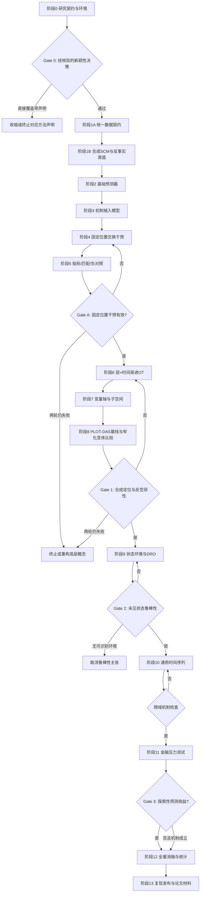
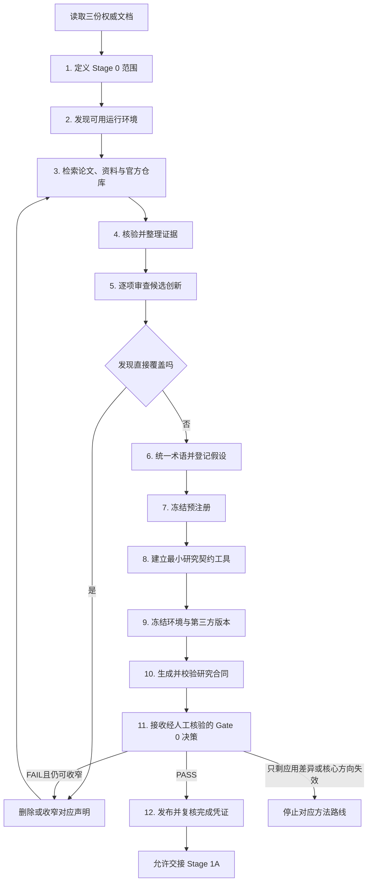

# TARCA 从零到一具体实施计划

> **文档版本**：v1.4
> **文档类型**：工程—实验一体化实施计划
> **依据文件**：`TARCA_项目计划书.md`
> **外部资料核对日期**：2026-08-20
> **Stage 1A 执行同步日期**：2026-08-22
> **Stage 0 边界**：Stage 0 负责研究契约、实验边界、依赖锁和证据规范，不训练正式模型。
> **契约优先级**：Stage 0 应冻结预注册、假设台账、新颖性声明和术语边界；后续实现必须服从这些研究契约。没有明确上位修订时，不得重新定义 Gate 或证据等级。
> **建议总周期**：39 周
> **核心原则**：先统一契约，再合成真值，后真实数据；先固定位置干预，后自动定位；先证明解释不是空洞映射，后讨论跨状态鲁棒；先通用时间序列，后金融压力测试。

---

## 0. 执行结论

本项目不能从股票数据、金融回测或完整四轴定位直接开始。正确的实施顺序是：

```text
研究契约与复现环境
→ 统一数据契约与产物 Schema
→ 合成动态 SCM 与反事实真值
→ 可预测的基础模型与机制植入模型
→ 固定位置的交换干预
→ 连续输出的抽象指标与负对照
→ 层 × 时间片的渐进 OT 定位
→ 变量/通道轴与低秩子空间定位
→ PLOT-guided DAS 基线与窄化 TARCA 子空间比较
→ 状态切换与 Wasserstein-DRO
→ 通用时间序列跨域实验
→ 金融数据泄漏审计与压力测试
→ 全量消融、统计检验和可复现发布
```

项目最重要的前置判断是：

1. **PatchTST 适合先验证“层 × 时间 patch”定位**，因为其将每个单变量序列切成 patch，并采用通道独立设计。
2. **变量/通道定位不能只依赖 PatchTST**。变量轴应在 iTransformer 或自定义“变量 × 时间 patch”二维 token 模型上完成；iTransformer 将每个变量序列表示为 variate token，变量位置具有更清晰的语义。
3. **PLOT、DiRoCA、CAE 和 pyvene 应作为方法、评测与工程参考，而不是直接拼接**。PLOT-guided DAS 是 `NOT_NOVEL` 基线；DiRoCA 与后续 transportability 工作已覆盖一般性的 Wasserstein/分布鲁棒因果抽象；CAE 已提供通用模拟系统上的因果抽象指标验证。TARCA 只保留冻结预测器、多步概率输出中独立的 forecast horizon/causal lag、变量联合真值、sequential unseen regime zero-refit 和反信息注入协议等窄化差异。
4. **真实金融实验不是早期调试场**。只有合成定位、负对照和跨状态解释通过门槛后，才允许进入金融数据。

---

## 1. 证据边界与本计划中的设计性质

### 1.1 由来源计划书直接规定的内容

以下内容来自项目计划书，实施时不得随意删除：

- 时序因果抽象的高层—低层交换干预；
- 候选位置按层 → 时间片/因果 lag → 变量/通道 → 受限子空间定位；
- 使用渐进式 OT 进行粗到细定位；
- 使用 DAS 对候选子空间进一步精修；IIT/联合训练只作为次级模式；
- 使用 Wasserstein 模糊集合提高跨状态抽象鲁棒性；
- 使用冻结模型、容量限制、随机概念、随机模型和 held-out intervention pairs 防止空洞解释；
- 证据链必须覆盖合成真值、通用时间序列和金融序列；
- 金融实验必须执行滚动切分、purging/embargo、发布时间对齐和统计检验。

### 1.2 外部资料直接支持的工程判断

- IIT 通过高层模型和低层模型中的交换干预行为进行训练。
- DAS 使用梯度学习分布式表示子空间，而不是只搜索单个神经元。
- PLOT 使用 OT/UOT 从输出干预效应定位候选位置，并支持“层/时间位置 → 坐标或 PCA 子空间 → DAS”的渐进过程。
- DiRoCA 使用 Wasserstein 模糊集合构造分布鲁棒因果抽象。
- proper score 可对单个 forecast–outcome pair 求值后聚合；calibration 是预测与观测的联合性质，只能在 fold/horizon/subgroup 或 regime 层解释。
- pyvene 支持对任意 PyTorch 模型的内部状态执行可组合干预。
- POT 提供 Sinkhorn、非平衡 OT、部分 OT、PCA/子空间相关工具及 PyTorch 后端。
- fev 支持滚动窗口、点预测和概率预测评估，并在任务摘要中记录 horizon、窗口配置、协变量和数据指纹，可用于规范评估与数据 Manifest。
- 多步预测文献明确区分静态输入、预测时已知的未来输入和只能从历史观测的输入，因此契约不能只保存无名称 Tensor，必须保存字段语义并检查目标泄漏。
- Pydantic v2 的模型配置支持严格校验、禁止额外字段和冻结字段绑定，适合 JSON/Manifest；运行时 Tensor 则更适合由标准冻结 dataclass 保持对象身份并做显式校验。
- Python `Protocol` 适合定义模型适配器的结构接口，但 `runtime_checkable` 只检查成员是否存在，不验证方法签名，不能替代静态检查和行为测试。
- PyTorch 的 Normal 分布要求 `scale > 0`；Apache Arrow Schema 能固定列名、类型、nullable 属性和 metadata，因此预测分布及 Parquet 产物应进行 fail-fast Schema 校验。

### 1.3 本实施计划新增的工程化决策

以下不是论文已经给出的结论，而是为保证项目可实现而采用的设计：

- MVP 先使用**对角高斯预测头**，使均值、尺度和分位数签名可以统一生成；
- 初始阶段先实现原生 PyTorch hook，再适配 pyvene，避免库适配问题阻断科学验证；
- 首先完成层 × 时间片两轴 PLOT，再增加变量轴和子空间轴；
- 先以精确小批量线性规划验证 Wasserstein-DRO，再实现可微分对偶近似；
- 所有 Go/No-Go 中“显著”“接近”“可接受”“稳定”等定性词及尚无支持的数值阈值统一标记为 `TO_BE_FROZEN_BEFORE_FIRST_FORMAL_EXPERIMENT`，需要在首次正式实验前冻结，不能观察测试结果后修改；
- Stage 0 建立 `src/tarca/contracts/` 的最小治理子集，Stage 1A 在同一位置扩展数据/科学契约；该目录始终是唯一跨模块契约权威来源，禁止同时维护 `src/tarca/data/contracts.py` 等第二套定义；
- 运行时 Tensor 契约与可序列化 Manifest 分离：前者使用冻结 dataclass 且不得隐式 clone/detach/搬移设备，后者使用严格 Pydantic 模型；
- 缺失值通过显式布尔 mask 表达，特征/目标/协变量必须带名称，所有持久化 Schema 必须携带可比较的契约版本。

### 1.4 主证据与次级训练模式

- **模式 A（主证据）**：先训练预测器并冻结参数，再学习解释器、位置、受限映射和子空间；Gate A/1/2 的所有 claim-bearing 结果只能来自该模式。
- **模式 B（探索性）**：允许联合优化预测器与抽象目标，用于 RQ4 消融或性能上界。联合训练只能作为次级证据，必须与模式 A 分表、分结论报告，不能证明模型原有机制，也不能支持 zero-refit 主张。

---

## 2. 总体架构与严格执行顺序



---

## 3. 总时间表

| 周期        | 阶段                  | 主要交付物                              | 进入下一阶段的条件           |
| --------- | ------------------- | ---------------------------------- | ------------------- |
| 第 1–2 周   | 阶段 0：研究契约与环境          | 文献矩阵、预注册、仓库、CI                     | Gate 0 通过或收缩声明后通过     |
| 第 3–6 周   | 阶段 1：数据契约与合成 SCM    | 合成生成器、反事实 oracle、数据审计              | 无干预时反事实等于事实；真值可复现   |
| 第 7–9 周   | 阶段 2：基础预测器          | 统计基线、PatchTST、概率头                  | 模型显著优于 naive；输出接口统一 |
| 第 10–12 周 | 阶段 3：机制植入模型         | 植入位置真值、困难度配置                       | 植入机制确实控制预测且位置可审计    |
| 第 13–16 周 | 阶段 4–5：固定干预与指标      | hook/pyvene 适配、IIC、Cause、Isolation | Gate A 通过           |
| 第 17–21 周 | 阶段 6：层 × 时间 OT      | 粗到细 PLOT、效率曲线                      | 候选定位优于随机和穷举成本       |
| 第 22–24 周 | 阶段 7–8：变量/子空间/DAS   | iTransformer 适配、低秩子空间、DAS 精修       | Gate 1 通过           |
| 第 25–28 周 | 阶段 9：Regime-DRO 与理论 | group-DRO、Wasserstein-DRO、初版证明     | Gate 2 通过或收缩主张      |
| 第 29–33 周 | 阶段 10：通用时序实验        | 三域结果、跨模型结果、失败诊断                    | 跨域机制检查通过（非 Gate 3） |
| 第 34–37 周 | 阶段 11：金融压力测试        | FI-2010、多资产实验、泄漏审计、探索性预测收益汇总       | 完成金融验证后评估 Gate 3    |
| 第 38–39 周 | 阶段 12–13：收尾         | 全消融、统计、复现包、论文图表                    | Gate 4 通过           |

> 说明：理论假设台账从第 1 周开始记录，但正式证明在算法接口稳定后，即第 22 周左右集中完成。这样避免围绕不断变化的算法证明无效命题。
> Stage 1 的任何实现仍须获得单独授权，但不例行重开 Gate 0。若后续已有的直接碰撞证据被明确提供并覆盖窄化声明，先更新新颖性表并收缩或终止对应主张。

---

# 第一部分：基础设施与科学契约

## 4. 阶段 0：研究契约、文献复核和可复现环境

### 4.1 目标、边界与唯一退出条件

Stage 0 应把“项目究竟要证明什么、不能声称什么、以后如何复现和审计”变成机器可校验的研究契约，且不训练正式模型、不下载正式数据、不执行 Stage 1 的 SCM、模型、干预、OT 或 DRO。操作入口包括 `README.md`、`docs/stage0_scope.md`、`pyproject.toml`、`uv.lock`、Stage 0 最小契约代码和对应测试。

Stage 0 的标准输出必须与协议一致：

```text
ResearchContractManifest
GateDecision(gate_id="GATE_0_NOVELTY")
Stage0CompletionReceipt
ArtifactRef(preregistration / novelty claims / assumption ledger /
            terminology / environment lock / third-party versions)
```

唯一退出条件是 Gate 0 为 `PASS`，或删除/收缩被覆盖的 claim 后再次审计并 `PASS`，随后发布并复核完成凭证。若只剩金融数据集差异，停止方法创新路线。计划文件和协议文件不记录某次执行状态；后续执行证据另存为上述结构化 artifact、Gate decision 与完成凭证。

#### 4.1.1 Stage 0 功能流程总览



流程必须按编号交接。Gate 0 由经人工核验并授权的结构化决策提供，不由仓库中的启发式代码自动重跑；不得在缺少该决策时进入 Stage 1A。

#### 4.1.2 每个流程的简单功能说明

| 编号 | 功能 | 用简单的话说 | 接收什么 | 交付什么 | 不通过时怎么办 |
|---|---|---|---|---|---|
| S0-01 | `define_stage0_scope()` | 先划清这两周做什么、不做什么 | 项目计划书、具体实施计划、协议 | `Stage0Scope` 与 `docs/stage0_scope.md` | 文档互相冲突时先修订计划，不开始编码 |
| S0-02 | `discover_execution_environment()` | 看清当前能用哪些 Python、CPU、GPU、内存和磁盘 | 本机环境；经单独授权后也可接收服务器环境事实 | `EnvironmentProfile` | 缺少 GPU 不失败；只有最小 CPU 检查也不能运行时才阻断 |
| S0-03 | `search_primary_sources()` | 按固定查询式找论文、官方资料和官方仓库 | 范围合同、查询式、检索日期 | `SourceCandidate[]` 和可复核查询日志 | 来源太少或只找到二手资料时继续检索 |
| S0-04 | `verify_and_catalog_sources()` | 判断来源是否真实、是否最新、代码能否合法参考 | 候选来源 | `related_work_matrix.csv` 与待冻结的第三方来源表 | 无法核验作者、版本或许可证时标为未知，不复制代码 |
| S0-05 | `classify_novelty_claims()` | 把每个候选创新分成“暂时保留、只做基线、删除” | 候选贡献、文献矩阵 | `novelty_claims.md` | 被直接覆盖就删除或收窄，然后返回检索步骤重新审查 |
| S0-06 | `define_terms_and_assumptions()` | 统一词义，并把尚未证明的前提单独登记 | 保留的 claim、协议术语 | `terminology.md` 与 `assumption_ledger.md` | 术语无法区分或假设不可验证时，不得进入预注册 |
| S0-07 | `freeze_preregistration()` | 在看正式结果前，先写清以后如何实验和判输赢 | 保留 claim、术语、假设、Gate 规则 | `preregistration_v0.md` | 缺少数据划分、指标、负对照或失败规则时继续补充 |
| S0-08 | `build_stage0_contract_tools()` | 做一套最小工具，让研究合同能被程序读取和检查 | 协议中的 Stage 0 类型和函数 | 最小 typed/atomic `ArtifactStore`、`src/tarca/contracts/`、`src/tarca/stage0/` 与测试 | 任一非法字段、错误 hash、非原子发布或缺失文件未能被拒绝时继续修复 |
| S0-09 | `lock_environment_and_sources()` | 把依赖和外部代码版本钉住，保证以后拿到同一内容 | Python 依赖、已核验官方仓库 | `uv.lock` 与 `third_party_manifest/sources.yaml` | 浮动分支、缺 commit 或许可证不明时禁止作为可复制依赖 |
| S0-10 | `freeze_and_verify_research_contract()` | 把前面所有文档装订成一个带 hash 的总合同 | 6 类研究 artifact | `ResearchContractManifest`；校验成功时函数正常返回 | 文件缺失、hash 不符、路径越界或 schema 错误时 fail closed |
| S0-11 | 人工核验与授权签发 | 判断这个研究方向是否仍值得进入实现；仓库只验证决策结构和 evidence hash | 研究合同、创新声明、直接碰撞证据 | `GateDecision(gate_id="GATE_0_NOVELTY")` | 可收窄则返回 S0-03/S0-05；只剩应用差异则停止对应方法路线 |
| S0-12 | `complete_stage0()` | 最后确认合同、人工决定和 artifact index 指向同一版本 | 已验证的研究合同、GateDecision、artifact index | 原子发布并可重新加载的 `Stage0CompletionReceipt` | 任一引用陈旧、hash 不符或凭证缺失时不得交接 Stage 1A |

#### 4.1.3 功能之间的标准交接

```text
权威文档
  -> Stage0Scope
  -> EnvironmentProfile + SourceCandidate[]
  -> RelatedWorkMatrix + ThirdPartySourceList
  -> NoveltyClaims
  -> Terminology + AssumptionLedger
  -> Preregistration
  -> Stage0 Contract Tools
  -> EnvironmentLock + ThirdPartyVersions
  -> ResearchContractManifest
  -> GateDecision(GATE_0_NOVELTY)
  -> Stage0CompletionReceipt
```

每个功能只消费上一步公开交付物，不读取聊天记忆、隐含假设或服务器身份。S0-01 至 S0-10 的“完成”只表示运行时产物通过相应校验，不写回本计划形成实施状态；本计划始终只定义应当如何执行。

#### 4.1.4 Stage 0 不负责的功能

- 不生成正式数据或训练预测模型；
- 不实现 SCM、内部干预、OT 定位、DAS 或 DRO；
- 不根据正式测试结果修改阈值；
- 不把服务器型号、GPU 数量或当前本机写成算力上限；
- 不因“用了金融数据”恢复已被文献覆盖的创新声明；
- 不把 README、聊天记录或执行日志当作研究合同。

### 4.2 可复现文献与仓库审计

创建：

```text
docs/
├── stage0_scope.md
├── related_work_matrix.csv
├── novelty_claims.md
├── assumption_ledger.md
├── terminology.md
└── preregistration_v0.md
```

检索只把一手论文、出版方页面、作者项目页和官方仓库作为 claim 证据；博客和二次总结只能帮助发现来源，不能单独关闭 Gate 0。`stage0_scope.md` 应保存检索日期、数据库/站点、完整查询式、纳入/排除标准、版本与已知检索局限。至少使用以下查询族：

1. causal abstraction / IIT / DAS / Boundless DAS；
2. progressive localization / optimal transport / causal abstraction；
3. distributionally robust causal abstraction / transportability；
4. causal abstraction metric / simulated complex systems / unmapped variables；
5. mechanistic interpretability / intervention / SAE / concept bottleneck + time series forecasting；
6. out-of-distribution / regime shift / invariant learning + time series forecasting；
7. anti-injection / nonlinear representation / random model / intervention OOD。

`docs/related_work_matrix.csv` 采用以下唯一 schema；若确需变更，应直接修订本计划并同步迁移该文件，不得维护第二套 schema：

| 字段 | 含义 |
|---|---|
| work_id | 论文或仓库唯一编号 |
| title | 标题 |
| year | 年份 |
| venue_status | 已发表、会议、预印本、工作坊 |
| paper_url | 论文、出版方页面或作者项目页的一手入口 |
| problem | 解决的问题 |
| intervention_type | 交换、路径、加性、替换等 |
| location_axes | 层、token、神经元、子空间等 |
| output_type | 分类、回归、分布 |
| robustness | 是否考虑环境变化 |
| anti_injection | 是否有反信息注入设计 |
| code_url | 官方代码；没有则留空 |
| reusable_component | 仅说明可参考内容，不等于允许复制 |
| gap_to_TARCA | 与 TARCA 窄声明的差异 |
| verification_date | 核对日期 |

截至 2026-08-20 的启动证据要求 Stage 0 至少逐项核对下列直接碰撞和最近邻。经人工核验形成 GateDecision 后，不要求仓库再例行补充检索：

- PLOT 已覆盖渐进 OT 定位和 PLOT-guided DAS，因此二者均为 `NOT_NOVEL`；
- DiRoCA 与 Generalised Transportability via Causal Abstractions 已覆盖一般性的 Wasserstein/分布鲁棒因果抽象与 transportability，因此一般性主张为 `NOT_NOVEL`；
- CAE 已在模拟复杂系统上验证因果抽象指标并加入对未映射变量的 faithfulness 检查，因此“通用因果抽象指标或模拟 benchmark”本身为 `NOT_NOVEL`；
- HyperDAS、Non-Linear Representation Dilemma、Good Apples 和 Representational Divergence 共同要求容量约束、随机负对照、分区诊断与干预后表示支持检查；
- TimeSAE、Dissecting Chronos、时间序列概念瓶颈和时间序列 Transformer 机制解释工作排除了“首次做时间序列机制解释”的表述；
- FOIL、COGS 等 OOD 时间序列方法是跨状态预测鲁棒性的最近邻，但不等同于冻结预测器上的机制抽象验证。

### 4.3 Gate 0 新颖性表与证伪规则

`docs/novelty_claims.md` 的每项声明必须包含：`claim_id`、状态、最近邻、实质差异、支持证据、可证伪实验、否决条件和失败动作。允许状态为 `PROVISIONAL`、`REQUIRED_SUPPORTING_CONTRIBUTION`、`NOT_NOVEL`、`DROP_CLAIM`、`KEEP_AS_BASELINE`；在 Gate 0 通过前不得写成已证实创新。

| TARCA 候选声明 | Stage 0 初始边界 | 最近邻 | 保留它所需的证伪实验 |
|---|---|---|---|
| 冻结多步概率预测器上的时序交换误差，并独立索引 forecast horizon 与 causal lag | `PROVISIONAL` | IIT / DAS / PLOT / TS concept bottleneck | 在正交的 horizon × lag 网格与 held-out intervention pairs 上验证两轴不可互换 |
| 变量 × causal lag × forecast horizon × 受限子空间联合真值定位 | `PROVISIONAL`；“一般四轴 PLOT”不得声称 | PLOT / HyperDAS / DAS | 在植入联合真值上同时恢复各轴，并相对 PLOT/Full DAS 报告误差与成本 |
| frozen forecaster 在 sequential unseen regime 上 zero-refit 的最坏抽象误差 | `PROVISIONAL`；一般 Wasserstein 鲁棒抽象不得声称 | DiRoCA / transportability / FOIL / COGS | predictor、位置、映射、normalizer 全部冻结，在顺序未见状态上无重拟合评估 |
| 反空洞与反信息注入协议 | `REQUIRED_SUPPORTING_CONTRIBUTION`，不单列为首要方法创新 | HyperDAS / Non-Linear Dilemma / Good Apples / CAE / Representational Divergence | 低容量、冻结、随机模型/概念/site、held-out pairs、未映射变量 faithfulness 与表示支持检查 |
| 通用因果抽象 metric/benchmark、PLOT-guided DAS、一般 Wasserstein 鲁棒抽象、金融应用、首次 TS 机制解释 | `NOT_NOVEL` | CAE / PLOT / DiRoCA / TimeSAE 等 | 只保留为基线、评测或压力测试，不得换名恢复为 claim |

检索中没有发现完全同名工作只能产生 `PROVISIONAL`，不能作为“首个”或“已证明新颖”的证据。任何最新直接碰撞都必须先更新表格、收缩 claim，再继续实现。

### 4.4 预注册、术语与假设台账

`docs/preregistration_v0.md` 应冻结：主要/次要 RQ、主/次证据、数据与模型族、intervention-pair 划分、预测和抽象指标、合成困难度轴、Gate predicate、允许调参范围、随机种子、统计检验、负对照、失败报告和偏离协议的修订流程。

未获得先验支持的数值阈值必须保留为 `TO_BE_FROZEN_BEFORE_FIRST_FORMAL_EXPERIMENT`，并在首次正式实验前用独立 pilot/validation 冻结；不得根据 test 结果反推阈值。预注册冻结科学配置与资源需求描述，不冻结某台机器或 GPU 型号。

`docs/terminology.md` 至少区分：模型计算因果与真实世界因果、forecast horizon 与 causal lag、预测鲁棒性与解释/抽象鲁棒性、zero-refit 与 test-time adaptation、fit/freeze/apply、unmapped-variable faithfulness、信息注入与干预后表示越界。

`docs/assumption_ledger.md` 每项至少记录 `assumption_id`、所支撑 claim、可观察代理、验证 Stage、违背后的动作和是否影响 Gate；不得把待验证假设写成事实。

### 4.5 最小仓库、契约代码与测试边界

Stage 0 只建立当前阶段必需的最小结构：

```text
tarca/
├── pyproject.toml
├── uv.lock
├── README.md
├── .gitignore
├── .pre-commit-config.yaml
├── .github/workflows/ci.yml
├── docs/
├── src/tarca/
│   ├── contracts/          # 仅 Stage 0 治理/Artifact/Gate 子集
│   └── stage0/
├── scripts/
├── tests/stage0/
└── third_party_manifest/
```

协议要求的 `StrictContractModel`、`Sha256Hash`、`ArtifactRef`、`ResearchContractManifest`、`GateStatus`、`GateSpec` 与 `GateDecision` 从 Stage 0 起放入唯一的 `src/tarca/contracts/`。除 Gate 0 外，Gate decision 绑定同版本 GateSpec 的 hash；`GATE_0_NOVELTY 是人工新颖性 Gate，不要求 GateSpec`，直接绑定 novelty claims 与 related-work bundle。Stage 1A 只扩展数据、预测、概念、干预与 Arrow Schema 契约，不得重建第二套基础类型。Stage 0 不创建 Stage 1 类型、SCM、模型、干预、OT 或 DRO 占位实现。

最小函数与 TDD 顺序为：

```python
freeze_research_contract(...) -> ResearchContractManifest
verify_research_contract(...) -> None
```

`GateDecision(GATE_0_NOVELTY)` 是经人工核验后签发的输入 artifact。Stage 0 代码只验证其 schema、状态、证据类型和 evidence hash，不实现自动新颖性判断器。

先编写缺文件、hash 不匹配、额外字段、非法 Gate 状态、序列化 round-trip 和最新碰撞未处理时失败的测试，再做最小实现。Pydantic 模型使用 strict、frozen、`extra="forbid"`；相对路径不得逃逸仓库根目录；artifact 内容 hash 必须由实际字节计算。

### 4.6 环境、算力与第三方来源冻结

依赖由 `pyproject.toml` 与 `uv.lock` 冻结，并与运行时生成的默认 `environment_profile.json` 一起装订为 `ENVIRONMENT_BUNDLE`，由 `ResearchContractManifest.environment_lock_ref` 绑定。默认 profile 用于提供可复现起点，运行时允许用户授权选择其他本地或服务器 backend；它不得被解释为固定算力边界。Windows 优先使用 `D:\software\MyAnaconda` 下与项目同名的 Conda 环境作为受控 bootstrap 解释器；不得向既有环境安装或升级依赖。`uv` 不在 PATH 时使用 `python -m uv`，并把项目依赖同步到仓库内隔离的 `.venv`。Linux、服务器和 CI 使用同一锁文件与 frozen 安装，不以 Makefile 作为唯一入口。权威命令写入 README，例如：

```powershell
D:\software\MyAnaconda\Scripts\conda.exe run -n tarca-local-py311 python -m uv sync --frozen --extra research --group dev
.\.venv\Scripts\python.exe scripts/doctor.py
.\.venv\Scripts\python.exe scripts/check_stage0.py
```

环境策略采用“运行时发现 + 分级资源配置”，不得把当前本机或某个服务器规格写成项目算力上限：

- Stage 0 的强制检查是 CPU 可完成的静态、import、序列化和微型数值 smoke；无 CUDA 只记录能力，不判失败；
- `doctor.py` 发现 CPU、内存、磁盘、CUDA/其他加速器、设备数量和 dtype 能力，但科学代码不得读取 SSH host 或固定 GPU 数量；
- 后续训练、上游复现和大规模干预在各 Stage 开始前，以最小代表性 probe 估计时间、内存、显存和存储，再选择本地、单机服务器、多卡服务器或其他等效 backend；
- 更换 backend 只能改变 execution profile，不得改变 seed、split、checkpoint、metric、Gate 或 scientific identity；
- 远程服务器仅在用户单独授权后，按 `TARCA_SERVER_ACCESS_RUNBOOK.md` 接入。

`scripts/doctor.py` 至少检查 Python/PyTorch/POT/pyvene、float32/float64 基本运算、固定种子、2×2 Sinkhorn、小型 PyTorch forward/hook、磁盘和写权限；不得下载模型或数据。`scripts/check_stage0.py` 聚合契约、文档、来源和环境检查。CI 使用 frozen/offline/CPU 最小门禁；它验证可移植下限，不代表未来正式实验只能使用 CPU。

第三方来源的唯一入口为：

```text
third_party_manifest/
├── sources.yaml
└── record_commits.py
scripts/
└── run_reference_smoke.py
src/tarca/stage0/
└── sources.py
```

`sources.yaml` 应记录官方论文/仓库、用途、许可证状态、允许动作（`DEPENDENCY`、`REFERENCE_ONLY`、`STATIC_ONLY`）、默认分支、固定 commit/tag、核验日期和可选本地 reference 路径。每个 `DEPENDENCY` 还必须记录 package name/version、官方 release tag 与对应 release commit，并与 `pyproject.toml` 的精确版本及 `uv.lock` 同时校验。`run_reference_smoke.py --network` 复核远端 commit、release tag 和已声明许可证文件；无网络模式仍须完成 schema 与依赖版本绑定检查。未发现许可证文件时按 `UNKNOWN` 处理，只允许引用或静态阅读，不得复制代码。PLOT、DiRoCA、HyperDAS、Good Apples、causalab 等均须先冻结许可证状态和 commit；POT、pyvene、CAE、FOIL、COGS 等也不得只写浮动分支。

研究合同和 Stage 0 artifact 默认冻结并拒绝覆盖。用户可显式授权覆盖，但必须同时提供授权理由；系统须在替换活动版本前归档旧 artifact，并生成包含前后 hash 和归档位置的审计回执。

### 4.7 十个工作日执行顺序

| 工作日 | 工作包 | 当日退出条件 |
|---|---|---|
| D1 | S0-01～02：初始化 Git、最小目录、README、Python/Conda/uv 入口；定义范围并发现环境 | 本地 CPU doctor 骨架可运行，范围内/外明确 |
| D2 | S0-03：冻结检索协议、查询式、来源质量和纳排标准 | 任一文献结论可由查询日志复核 |
| D3–D4 | S0-04：填充 related-work matrix 与官方仓库清单 | 直接碰撞、TS 最近邻、OOD、反空洞、工具链均有一手来源 |
| D5 | S0-05：写 novelty claims 并逐项执行保留/排除判断 | 每项有状态、最近邻、证伪实验、否决条件、失败动作 |
| D6 | S0-06：写 terminology 与 assumption ledger | horizon/lag、两类 causality、zero-refit 等边界无歧义 |
| D7 | S0-07：写 preregistration v0 | RQ、证据、划分、指标、Gate、负对照、统计与失败报告已冻结 |
| D8 | S0-08：按 TDD 实现 Stage 0 最小 typed contracts 与两个研究合同函数 | round-trip 和 fail-closed 测试通过；无 Stage 1 占位代码或自动新颖性判断器 |
| D9 | S0-09：冻结环境与第三方版本；完成 doctor/reference smoke | 锁文件可 frozen 恢复；每个仓库有 commit、许可证状态和允许动作 |
| D10 | S0-10～12：生成研究合同，接收经核验的 GateDecision，发布完成凭证，并运行 `check_stage0.py` 与本地 CI 等价门禁 | 仅 Gate 0 `PASS` 且完成凭证复核通过后可交接 Stage 1A |

### 4.8 本阶段验收

- 协议列出的 6 类 `ArtifactRef` 均由实际内容 hash 绑定，`ResearchContractManifest` 可严格 round-trip；
- 所有结构化 Stage 0 artifact 经 typed/atomic `ArtifactStore` 写入、重新加载和严格 schema 校验；完成凭证绑定同版研究合同、GateDecision 与 artifact index；
- `GateDecision(gate_id="GATE_0_NOVELTY")` 对直接碰撞 fail closed，且不把 `PROVISIONAL` 写成已证实；
- related-work matrix 至少包含 PLOT、DiRoCA、Generalised Transportability、CAE、HyperDAS、Non-Linear Representation Dilemma、Good Apples、Representational Divergence、TimeSAE、Dissecting Chronos、TS concept bottleneck、ForecastCF、FOIL 和 COGS；
- 所有保留 claim 都有最近邻、可证伪实验、否决条件和失败动作；所有 `NOT_NOVEL` 条目只能作为基线、工具或验证层；
- `python scripts/doctor.py` 和 `python scripts/check_stage0.py` 在 frozen CPU 环境通过；CUDA/服务器是可选 execution backend，不是 Stage 0 前置条件或项目上限；
- 测试无网络、无正式数据/模型下载、无训练；第三方 commit、许可证状态和允许动作完整；
- Stage 0 不产生实施状态报告，也不修改计划书/协议记录某次运行结果；实际执行证据只进入结构化 artifact 与 Gate decision。

Stage 1A 开始前不例行重开 Gate 0 或追加文献。若用户要求重新核验，或明确的直接碰撞证据进入项目，则对应 claim 必须 fail closed 并由新的人工授权决策替换旧决策。

---

# 第二部分：合成真值与基础预测器

## 5. 阶段 1：统一数据契约（第 3 周）

### 5.1 这一阶段在做什么

先规定所有数据、预测输出、概念、干预位置、干预请求、模型适配器和实验产物的语义与形状，避免后续模块各自定义接口而无法连接。本阶段只实现契约、校验和测试，不生成正式数据、不训练模型、不执行内部干预。

### 5.2 权威位置与版本边界

所有跨模块契约统一放在：

```text
src/tarca/contracts/
```

该目录是唯一权威来源。`data`、`models`、`concepts`、`interventions`、`localization` 和 `metrics` 只能导入这些契约，不得再创建 `data/contracts.py` 或复制同名 class。

定义：

```python
CONTRACT_SCHEMA_VERSION = "1.0.0"
```

所有可持久化 Manifest 和 Arrow Schema 都必须携带该版本。运行时张量对象采用 `@dataclass(frozen=True, slots=True)` 与显式校验；JSON/Parquet 元数据采用 Pydantic v2 `BaseModel`，默认 `extra="forbid"`、`frozen=True`、`strict=True`。冻结只限制字段重新绑定，不表示 Tensor 内容在物理上不可修改。

### 5.3 核心运行时数据结构

#### `WindowBatch`

```python
@dataclass(frozen=True, slots=True)
class WindowBatch:
    x: Tensor                         # [B, L, D]
    y: Tensor | None                  # [B, H, Dy]；纯推理时可为 None
    observed_covariates: Tensor | None        # [B, L, Do]
    known_future_covariates: Tensor | None    # [B, H, Dk]
    x_observed_mask: Tensor | None
    y_observed_mask: Tensor | None
    observed_covariates_mask: Tensor | None
    known_future_covariates_mask: Tensor | None
    regime: Tensor | None             # [B]
    window_id: tuple[str, ...]
    input_feature_names: tuple[str, ...]
    target_names: tuple[str, ...]
    observed_covariate_names: tuple[str, ...]
    known_future_covariate_names: tuple[str, ...]
    feature_start: tuple[datetime, ...]
    feature_end: tuple[datetime, ...]
    prediction_start: tuple[datetime, ...]
    label_end: tuple[datetime, ...]
    forecast_time: tuple[tuple[datetime, ...], ...]  # B × H
    metadata: Mapping[str, JSONValue]
```

必须满足：

- 所有 batch 维一致，名称数量与最后一维一致；
- `known_future_covariate_names` 与 `target_names` 不相交；
- `window_id` 批内唯一，train/validation/test 间不重叠；
- 时间统一为 timezone-aware UTC，且 `feature_start <= feature_end < prediction_start <= label_end`；
- 每个样本的 `forecast_time` 严格递增并处于预测区间；
- 数值 Tensor 保持有限，缺失性由同形状 bool mask 表达，不以 NaN 充当跨模块协议；
- 校验不得隐式 clone、detach、改变 dtype、移动 device 或关闭 `requires_grad`。

#### `ForecastDistribution`

```python
@dataclass(frozen=True, slots=True)
class ForecastDistribution:
    mean: Tensor                      # [B, H, Dy]
    scale: Tensor | None              # [B, H, Dy]
    quantiles: Mapping[float, Tensor]
    logits: Tensor | None             # [B, H, Dy, C]
    samples: Tensor | None            # [S, B, H, Dy]
    window_id: tuple[str, ...] | None
    target_names: tuple[str, ...]
```

必须验证：`scale > 0`；分位数水平位于 `(0,1)` 且逐元素单调；所有输出形状、device 和浮点 dtype 兼容；不允许通过取绝对值、排序预测值等方式静默修复错误输入。

#### `ConceptBatch`

```python
@dataclass(frozen=True, slots=True)
class ConceptBatch:
    values: Tensor                    # [B, K]
    valid_mask: Tensor                # [B, K]，bool
    names: tuple[str, ...]
    window_id: tuple[str, ...]
    computed_from_history_only: bool
    definition_version: str
```

`computed_from_history_only` 必须显式给出；正式实验是否允许该概念进入干预，由后续泄漏审计决定。

#### `InterventionSite` 与 `InterventionSpec`

位置目录和执行请求必须分离：

```python
@dataclass(frozen=True, slots=True)
class InterventionSite:
    site_name: str
    layer: int | None
    tensor_rank: int
    batch_axis: int
    variable_axis: int | None
    patch_axis: int | None
    feature_axis: int
    shape_template: tuple[int | None, ...]
```

```python
@dataclass(frozen=True, slots=True)
class InterventionSpec:
    site_name: str
    layer: int | None
    variable_index: int | None
    patch_index: int | None
    lag: int
    subspace_basis: Tensor | None
    intervention_kind: InterventionKind
```

`site_name` 是位置的稳定主键；`layer` 仅作为可审计的冗余字段，解析后必须与对应 `InterventionSite` 一致。`SUBSPACE_SWAP` 必须提供有限、二维且满足预注册正交容差的基底；其他干预类型不得携带无意义的基底。

### 5.4 可序列化契约

使用严格 Pydantic 模型实现：

```text
InterventionPair
DataManifest
RunManifest
MetricRecord
ArtifactLayout
```

`InterventionPair` 至少包含：

```text
schema_version
pair_id
partition                 # train / validation / test
base_window_id
source_window_id
concept_name
regime_relation           # same / cross / unknown
matching_distance
concept_delta
```

必须满足 base/source 不同、距离有限且非负，并使用稳定哈希生成 `pair_id`。同一窗口不能跨 intervention-pair partition 泄漏。

`DataManifest` 至少记录 dataset name/version/hash、split hash/count、窗口契约和来源说明；`RunManifest` 至少记录 experiment/run id、config/data hash、Git commit、contract version、创建时间和状态。本阶段只定义 Schema，不伪造正式数据或实验结果。

### 5.5 模型适配器接口

```python
class ForecastModelAdapter(Protocol):
    @property
    def adapter_name(self) -> str: ...

    @property
    def model_hash(self) -> str: ...

    @property
    def is_frozen(self) -> bool: ...

    def predict_distribution(
        self, batch: WindowBatch
    ) -> ForecastDistribution: ...

    def list_intervention_sites(
        self
    ) -> tuple[InterventionSite, ...]: ...

    def capture(
        self,
        batch: WindowBatch,
        sites: tuple[InterventionSite, ...],
    ) -> Mapping[str, Tensor]: ...

    def intervene(
        self,
        base: WindowBatch,
        source: WindowBatch,
        spec: InterventionSpec,
    ) -> ForecastDistribution: ...
```

`Protocol` 只定义结构化接口；运行时成员存在检查不能证明方法签名正确，必须结合静态类型检查、fake adapter 行为测试和后续真实 adapter 测试。本阶段不得提前实现 PatchTST/iTransformer adapter 或 hook。

### 5.6 结果目录与 Arrow Schema 契约

每次正式运行必须产生：

```text
artifacts/<experiment_id>/<run_id>/
├── config.yaml
├── metrics.json
├── metrics_by_regime.parquet
├── predictions.parquet
├── intervention_pairs.parquet
├── data_manifest.json
├── environment.txt
├── git_state.txt
├── stdout.log
└── plots/
```

目录验证必须拒绝绝对路径、`..` 和路径穿越。三个 Parquet 文件分别定义显式 Arrow Schema，至少固定列名、数据类型、nullable 行为和 `contract_schema_version` metadata；Schema 校验不能只比较列名。

推荐 long format：

- `metrics_by_regime.parquet`：experiment/run/split/metric/value/regime/horizon/concept；
- `predictions.parquet`：window/split/forecast_time/horizon/target/y_true/mean/scale；
- `intervention_pairs.parquet`：完整 `InterventionPair` 字段。

### 5.7 契约测试

至少覆盖：

- 错误 rank、shape、batch size、device 或 dtype 立即报错；
- 特征名称数量不一致、known-future 与 target 重叠时失败；
- naive datetime、非单调时间和时间区间越界时失败；
- mask 形状或 dtype 错误、数值非有限时失败；
- train/validation/test 与 intervention-pair partition 无交集；
- `scale <= 0`、非法 quantile level 和 quantile crossing 时失败；
- `InterventionSite` 轴重复/越界和非法子空间时失败；
- Tensor identity、device、dtype 和 `requires_grad` 在校验后不变；
- JSON Schema、Arrow Schema 和临时 Parquet round-trip 可复现；
- Stage 0 全量测试继续通过，且本阶段不下载数据、不训练模型。

### 5.8 Stage 1A 实际执行同步（2026-08-22）

本节只同步工程执行状态和交接位置，不改变项目计划书、端到端协议、CCP-0001 或冻结 Stage 0 研究契约的优先级，也不把工程验收结果升级为科学证据或新的 Gate。详细、可追溯的执行记录保存于：

```text
docs/auth/TARCA_STAGE1A_HANDOFF_SNAPSHOT_2026-08-22.md
```

截至该日期，Stage 1A 的工程边界状态为 `PASS`，具体含义是：

- 已在 `src/tarca/contracts/` 的同一权威位置扩展数据、预测、概念、干预、指标、Artifact 和 Adapter 契约，没有建立第二套基础类型；
- 已实现 registry 驱动的 persisted dataset repository、sealed access fail-closed 校验、按物理分区读取、真实 SHA-256 验证和 `LeakageAudit`；
- 已实现 `WindowBatch`、`ForecastDistribution`、`ConceptBatch`、`InterventionSite`、`InterventionSpec` 等运行时结构及显式 shape/time/name/mask/device/dtype 校验；
- 已冻结 predictions、intervention pairs、effects、metrics、localization 五套 Arrow Schema，并验证字段顺序、类型、nullability 与 metadata；
- 已实现类型化、本地、原子 `ArtifactStore`，加载时消费的就是通过哈希验证的同一份字节；
- 已增加跨 TRAIN/VALIDATION/TEST 物理分区的 `window_id` 隔离审计，不拼接、不重切分数据；
- 已完成最小 typed data → predictor → Arrow table → verified artifact 闭环；
- 未下载或生成正式数据，未训练模型，未执行内部干预，未创建可支撑科学结论的实验结果；
- `STAGE1_SYNTHETIC_CONFIG` 在 Stage 1A 仍然 fail closed，合成 SCM、normalization、真值和正式物理切分继续由 Stage 1B 负责。

本状态不自动授权 Stage 1B 正式运行。进入 Stage 1B 时仍须沿用同一 `DatasetSpec`、`DataManifest`、`WindowBatch`、ArtifactStore 和冻结研究契约，并在生成完整物理分区后显式运行跨分区隔离审计。

---

## 6. 阶段 1：合成 regime-switching SCM（第 4–6 周）

### 6.1 这一阶段在做什么

创建一个“答案已知”的时序世界。只有在这里，才能判断方法是否真的恢复了概念、延迟和位置，而不是生成看似合理的图。

### 6.2 生成模型

实现：

```text
src/tarca/data/synthetic/
├── regimes.py
├── latent_concepts.py
├── nonlinear_var.py
├── counterfactual_oracle.py
├── missingness.py
├── dataset_builder.py
└── validation.py
```

建议使用显式潜变量结构：

$$
r_{t+1}\sim P(r_{t+1}\mid r_t)
$$

$$
C^{trend}_{t+1}
=
a_{r_t}C^{trend}_{t}
+\xi_t
$$

$$
C^{scale}_{t+1}
=
b_{r_t}C^{scale}_{t}
+\omega_t
$$

$$
X_{t+1}
=
A^{(r_t)}X_t
+
g^{(r_t)}(X_{t-\delta})
+
M C_t
+
B^{(r_t)}U_t
+
\sigma(C^{scale}_t)\epsilon_t
+
S_t
$$

其中：

- `r_t`：离散状态；
- `C_trend`：趋势/持续性；
- `C_scale`：局部尺度/波动；
- `U_t`：可观测外生变量；
- `S_t`：稀疏冲击；
- `A_r`：状态相关的跨变量传播矩阵；
- `delta`：真实延迟；
- `epsilon_t`：未来噪声。

### 6.3 MVP 概念顺序

不要一次实现全部概念。按顺序增加：

1. **趋势**；
2. **局部尺度/波动**；
3. **跨变量传播**；
4. **稀疏冲击**；
5. **外生影响**；
6. **均值回复/持续性切换**。

Stage 1 前六个实施周的概念范围只要求趋势和波动。

### 6.4 反事实 oracle

生成数据时保存：

```text
latent_concepts
regime_sequence
exogenous_noise
shock_sequence
true_delay
true_graph
random_seed
```

高层概念干预必须使用**相同的未来外生噪声**进行 paired counterfactual：

```python
y_factual = scm.rollout(state_t, future_noise)
y_cf = scm.rollout(
    state_t.replace(concept=source_concept),
    same_future_noise
)
effect = y_cf - y_factual
```

概率输出通过多个未来噪声样本估计：

```python
for m in range(num_mc):
    noise = future_noise_bank[m]
    factual[m] = rollout(base_state, noise)
    counterfactual[m] = rollout(intervened_state, noise)
```

这样可以得到：

- $\Delta\mu_{1:H}$；
- $\Delta\sigma_{1:H}$；
- $\Delta q_{\alpha,1:H}$；
- 延迟后的效应峰值；
- 跨变量效应路径。

### 6.5 数据集配置

至少提供：

```yaml
synthetic_easy:
  D: 4
  L: 48
  H: 12
  regimes: 2
  true_delay: 2
  snr: high
  concept_overlap: low
  missing_rate: 0.0

synthetic_medium:
  D: 8
  L: 96
  H: 24
  regimes: 3
  true_delay: [1, 4]
  snr: medium
  concept_overlap: medium
  missing_rate: 0.05

synthetic_hard:
  D: 16
  L: 192
  H: 48
  regimes: 4
  true_delay: [0, 8]
  snr: low
  concept_overlap: high
  missing_rate: 0.15
```

### 6.6 数据切分

按连续时间切分，不随机打乱：

```text
train: 前 60%
validation: 中间 20%
test_seen_regime: 后 10%，状态组合在训练中出现
test_unseen_regime: 后 10%，保留的状态参数或状态组合
```

未见状态可通过以下方式产生：

- 保留一个 regime；
- 改变传播矩阵 $A_r$；
- 改变波动函数；
- 改变真实延迟；
- 改变噪声尾部；
- 高层 SCM 小幅错设。

### 6.7 合成数据单元测试

1. 固定种子可完全复现；
2. 相同状态、相同噪声、无干预时输出相同；
3. 只干预趋势时，波动潜变量不变；
4. 只干预尺度时，期望均值变化应小于方差变化；
5. 错误延迟的效应峰值偏离真值；
6. 训练/验证/测试时间不重叠；
7. 所有标准化只在训练期拟合；
8. 缺失机制不读取未来。

### 6.8 实验 E01：SCM 真值验证

比较：

- 解析/Monte Carlo 的真实干预效应；
- 经验模拟估计；
- 错误高层 SCM；
- 随机概念。

报告：

- 效应均值误差；
- 分位数误差；
- 延迟恢复误差；
- Monte Carlo 方差；
- 不同样本量下的收敛曲线。

通过条件：

- 正确高层 SCM 的误差随 Monte Carlo 数增加而下降；
- 错误 SCM 和随机概念明显更差；
- 真值延迟可从效应曲线中恢复。

实施同步（2026-08-30）：E01 已统一冻结为 `v2/PASS`。解析 E01-A 正式运行 50 个 TEST 种子，
覆盖真值 48/50，其余 MCSE、区间精度、lag、identity 和三类负对照检查均为 50/50，总体偏差
0.0001294253（门槛 0.005）；Lorenz-96 E01-B 使用 v1 中已通过的 5/5 证据，经原字节 SHA-256
复核后并入 v2。活动收据与完整交接分别见 `artifacts/e01/frozen/v2/qualification_receipt.json`
和 `docs/auth/TARCA_E01_HANDOFF_SNAPSHOT_2026-08-30.md`。E01 通过只解除 oracle 稳定性阻塞，
Stage 2 与 E02 已按各自冻结契约完成；下一步只能进入 Stage 3 的机制植入与 E03，仍不得直接进入 Stage 4。

---

## 7. 阶段 2：基础预测器和概率输出（第 7–9 周）

### 7.1 这一阶段在做什么

先训练一个能正确预测的模型。如果模型本身没有学到任务，后续定位内部机制没有意义。

### 7.2 基线顺序

按计算成本依次实现：

1. Last value / Seasonal naive；
2. AR/VAR；
3. 线性模型或 DLinear；
4. 小型 PatchTST；
5. 小型 iTransformer。

正式机制定位先使用小型模型：

```yaml
d_model: 64
n_layers: 3
n_heads: 4
dropout: 0.1
```

### 7.3 PatchTST 用途

PatchTST 第一阶段只承担：

- 时间 patch 表示；
- 层 × 时间位置干预；
- 对比 PLOT 的 timestep/patch 粗定位。

它不承担完整跨变量机制主张，因为其通道独立设计削弱了变量间内部交互语义。

### 7.4 iTransformer 用途

iTransformer 后续承担：

- 变量 token 定位；
- 跨变量传播概念；
- 变量间 attention 路径分析；
- 层 × 变量 × 子空间定位。

### 7.5 概率预测头

MVP 使用对角高斯：

```python
mean = mean_head(hidden)
log_scale = scale_head(hidden).clamp(min=-7, max=5)
scale = softplus(log_scale) + 1e-5
```

训练损失：

$$
\mathcal L_{\text{forecast}}
=
-\log p_\theta(y\mid \mu,\sigma)
$$

同时输出由高斯分布计算的分位数。后续真实数据若明显非高斯，再增加：

- 多分位数 pinball head；
- Student-t head；
- 样本生成头。

不要在 MVP 阶段同时实现所有概率头。

### 7.6 模型 adapter

每个模型必须返回统一的命名位置：

```text
encoder.layer.0.pre_attn
encoder.layer.0.post_attn
encoder.layer.0.post_ffn
encoder.layer.1...
patch_embedding
forecast_head_input
```

并记录每个位置张量语义：

```yaml
site: encoder.layer.1.post_ffn
shape: [B, D, P, d_model]  # PatchTST adapter 统一后的视图
axes:
  variable: 1
  patch: 2
  feature: 3
```

### 7.7 实验 E02：预测器有效性

> Stage1B 世界确认与 E02 正式实验严格分离。经授权的双尺度短期确认范围、盲确认种子、
> 主要时距和绝对校准护栏见 `TARCA_PROTOCOL_CHANGE_CONTROL_CCP_0002.md`。该确认只决定
> 后续可解释的“世界—模型—时距”对象，不执行 E02，也不使用 E02 保留种子。

比较：

- naive；
- AR/VAR；
- DLinear；
- PatchTST；
- iTransformer。

报告：

- NLL；
- MAE/MSE；
- CRPS 或样本近似 CRPS；
- coverage；
- calibration error；
- 分状态指标。

通过条件：

- 至少一个神经预测器稳定优于 naive 和线性基线；
- 三个随机种子趋势一致；
- 未见状态性能会下降，但不是完全失效；
- 概率输出没有严重数值问题。

实施同步（2026-09-01）：Stage 2 v1 已沿用固定 run 完成同运行恢复，最新图状态为
`37/37 COMPLETED`，并发布状态为 `FROZEN` 的 receipt；strongest linear 固定为 `VAR`，
primary iTransformer seed 固定为 `1797287582`。E02 已完成 `COMPLETED/PASS`：120/120 条正式轨迹
完成、24/24 个预注册 Gate 通过，最终 receipt 已独立重算验证。完整运行身份、E02 指标、证据回收
边界与下一阶段限制见 `TARCA_E02_HANDOFF_SNAPSHOT_2026-09-01.md`。

---

## 8. 阶段 3：机制植入网络（第 10–12 周）

### 8.1 这一阶段在做什么

构造“模型内部位置答案已知”的预测器，用于检查定位算法是否真的找到层、变量、时间片和子空间。

### 8.2 两类机制植入模型

#### A. 硬植入模型

在指定位置显式写入：

$$
h_{\ell^*,d^*,p^*}
\leftarrow
h_{\ell^*,d^*,p^*}
+
U^* z_k
$$

其中：

- $\ell^*$：真实层；
- $d^*$：真实变量；
- $p^*$：真实 patch；
- $U^*\in\mathbb R^{d_{model}\times r}$：真实低秩子空间；
- $z_k$：概念值。

预测头必须读取 $U^*z_k$，使干预该子空间能改变输出。

#### B. 训练后植入模型

先训练普通预测器，再在指定层加入低秩 adapter：

```python
h = h + U @ concept_encoder(c)
```

只训练 adapter 和预测头，使机制位置仍然可知，但背景表示更接近真实网络。

### 8.3 植入难度

```yaml
plant_easy:
  layers: [1]
  variables: [2]
  patches: [3]
  rank: 1
  overlap: false

plant_medium:
  layers: [1, 2]
  variables: [1, 4]
  patches: [2, 3]
  rank: 2
  overlap: partial

plant_hard:
  layers: [0, 2]
  variables: [0, 3, 7]
  patches: [1, 5, 6]
  rank: 4
  overlap: true
  distractor_subspaces: 4
```

### 8.4 位置真值格式

```json
{
  "concept": "trend",
  "sites": [
    {
      "layer": 1,
      "variable": 2,
      "patches": [3, 4],
      "subspace_rank": 2,
      "basis_file": "trend_U.npy"
    }
  ]
}
```

### 8.5 实验 E03：植入机制有效性

执行：

1. 普通预测；
2. oracle 位置交换；
3. 随机位置交换；
4. 正交补空间交换；
5. 删除植入分量。

报告：

- oracle 干预的输出效应；
- 随机位置效应；
- 正交补空间效应；
- 预测性能变化；
- 概念解码能力。

通过条件：

- oracle 位置能产生与高层干预方向一致的效应；
- 随机位置和正交补空间效应显著更小；
- 删除机制后预测性能或对应概念效应明显下降；
- 植入模型仍保留合理预测性能。

---

# 第三部分：交换干预、指标和负对照

## 9. 阶段 4：固定位置时序交换干预（第 13–14 周）

### 9.1 这一阶段在做什么

先假设我们已经知道正确位置，只验证“替换内部表示后，预测是否按高层概念干预变化”。

### 9.2 实现顺序

1. 原生 PyTorch forward hook；
2. 经过单元测试后适配 pyvene；
3. 比较两种实现输出是否一致。

文件：

```text
src/tarca/interventions/
├── hooks.py
├── cache.py
├── temporal_swap.py
├── subspace_swap.py
├── lag_alignment.py
├── source_matching.py
└── pyvene_adapter.py
```

### 9.3 完整表示交换

对基础样本 $x$ 和来源样本 $x'$：

```python
base_act = capture(model, x, site)
source_act = capture(model, x_prime, site)

intervened_act = source_act
y_do = resume_forward(model, x, site, intervened_act)
```

### 9.4 子空间交换

对基底 $U$：

$$
h^{do}
=
h_{base}
+
UU^\top(h_{source}-h_{base})
$$

并保留正交补空间：

$$
(I-UU^\top)h_{base}
$$

必须检查 $U^\top U\approx I$。

### 9.5 时间 patch 与时延

干预位置：

```text
base patch p
← source patch p + δ
```

对 $\delta\in[-\Delta,\Delta]$ 扫描。边界 patch 不足时丢弃，不使用循环填充。

### 9.6 激活缓存

缓存键：

```text
(model_hash, checkpoint_hash, dataset_hash, window_id, site_name)
```

推荐使用 Zarr/HDF5，按：

```text
layer → variable → patch → feature
```

分块。缓存必须包含 shape、dtype 和 model hash，避免旧缓存污染新模型。

### 9.7 干预单元测试

- 不替换时输出与原始 forward 一致；
- source=base 时输出不变；
- 替换后模型参数不变；
- hook 在异常后正确移除；
- 子空间 rank=0 时无效应；
- 子空间 rank=d_model 时等价于完整交换；
- PyTorch hook 与 pyvene 输出误差低于数值容差；
- batch 内每个样本可使用不同 source。

---

## 10. 阶段 5：来源窗口匹配（第 15 周）

### 10.1 这一阶段在做什么

交换干预不能随便拿两个差异巨大的窗口互换。需要让来源窗口主要在目标概念上不同，而非目标协变量尽量相似。

### 10.2 匹配约束

对目标概念 $C_k$：

- 概念差异：
  $$
  |C_k(x')-C_k(x)|\ge \tau_k
  $$
- 非目标概念距离尽量小；
- 历史可观测协变量距离尽量小；
- primary 实验要求 same-regime；
- stress 实验允许 cross-regime；
- source 与 base 必须来自不同时间段；
- 训练 intervention pair 与测试 pair 不得共享窗口。

### 10.3 匹配算法

按顺序实现：

1. 分层随机匹配；
2. 标准化欧氏距离最近邻；
3. Mahalanobis 最近邻；
4. 局部 OT 匹配。

初始距离：

$$
d_{match}
=
\|z_{non-target}(x)-z_{non-target}(x')\|_2
+
\lambda_x
\|\phi(x)-\phi(x')\|_2
$$

其中 $\phi(x)$ 只使用历史摘要：

- 局部均值；
- 局部方差；
- 自相关；
- 缺失率；
- 外生变量；
- regime 标签。

### 10.4 匹配诊断

报告：

- 匹配前后非目标协变量标准化均值差；
- 目标概念差异分布；
- source 使用次数；
- 时间距离；
- same/cross regime 比例；
- 匹配失败率。

source 不能被少量样本垄断，可设置每个 source 最大复用次数。

---

## 11. 阶段 5：抽象指标（第 15–16 周）

### 11.1 高层与低层效应签名

$$
e_k^H
=
[
\Delta\mu_{1:H},
\Delta\sigma_{1:H},
\Delta q_{0.1,1:H},
\Delta q_{0.5,1:H},
\Delta q_{0.9,1:H}
]
$$

$$
e_s^L
=
[
\Delta\mu^L_{1:H},
\Delta\sigma^L_{1:H},
\Delta q^L_{0.1,1:H},
\Delta q^L_{0.5,1:H},
\Delta q^L_{0.9,1:H}
]
$$

所有维度使用训练 intervention pairs 估计的尺度标准化，验证/测试不重新拟合。

效应签名只描述预测分布本身的变化，不加入单样本“calibration”分量。若合成 oracle 或真实目标 $y_i$ 可用，可另报逐样本 $\Delta\mathrm{NLL}_i$、$\Delta\mathrm{CRPS}_i$ 或固定分位数的 $\Delta\mathrm{pinball}_{\alpha,i}$；PIT、coverage、reliability 和 calibration error 必须在 `fold × horizon × subgroup/regime` 上聚合，且不得作为测试时定位输入。

### 11.2 TII 距离

MVP：

$$
D(e^H,e^L)
=
\sum_j w_j
\operatorname{Huber}
\left(
\frac{e_j^H-e_j^L}{s_j+\epsilon}
\right)
$$

后续增加：

- 1D Wasserstein；
- energy distance；
- CRPS difference；
- 输出样本的 sliced Wasserstein。

### 11.3 Cause

目标概念的低层干预效应是否接近高层干预效应：

$$
Cause_k = 1-\frac{D(e_k^H,e_s^L)}{D_{norm}+\epsilon}
$$

### 11.4 Isolation

干预概念 $k$ 时，非目标概念对应输出不应发生不必要变化：

$$
Isolation_k
=
1-
\frac{1}{K-1}
\sum_{j\ne k}
\frac{\|\Delta e_j^L\|}{D_{norm,j}+\epsilon}
$$

### 11.5 Completeness

选定位置集合相对 oracle 全位置效应的覆盖：

$$
Completeness
=
\frac{\|e_{selected}^L\|}
{\|e_{oracle/full}^L\|+\epsilon}
$$

### 11.6 定位指标

- site-level Precision/Recall/F1；
- layer accuracy；
- variable F1；
- patch IoU；
- subspace principal-angle distance；
- rank recovery error；
- Top-k recall；
- average precision。

### 11.7 指标测试

构造手工效应向量：

- 完全一致时 IIC=1；
- 完全相反时显著降低；
- 只改变尺度时均值项不应错误惩罚；
- 标准化不能读取测试数据；
- 高层效应为零时使用独立 normalizer，避免除零产生虚假高分。

---

## 12. 实验 E04：固定位置交换干预与负对照

### 12.1 正实验

- oracle site；
- oracle subspace；
- 正确 concept source；
- 正确 lag；
- same regime。

### 12.2 负对照

- 随机概念；
- 打乱 concept label；
- 错误 source；
- source=base；
- 错误 lag；
- 随机层；
- 随机 patch；
- 随机子空间；
- 随机初始化模型；
- 未来标签可见的故意泄漏版本，仅作 sanity check；
- 参数量匹配但无因果限制的映射器。

### 12.3 反信息注入检测

训练一个 probe，仅输入解释映射输出，预测未来目标：

```text
probe(mapping_output) → y
```

比较：

- 低秩映射；
- 非线性高容量映射；
- 随机模型；
- 标签泄漏版本。

若映射器单独即可高精度预测目标，或随机模型也达到高 IIC，说明方法可能在注入信息。

### 12.4 Gate A：固定位置干预门槛

以下判定项全部必须满足；具体数值为 `TO_BE_FROZEN_BEFORE_FIRST_FORMAL_EXPERIMENT`：

- oracle site 的 held-out IIC 明显高于随机 site；
- Cause 高且 Isolation 不崩溃；
- source=base 效应接近 0；
- 错误 lag 的性能低于真值 lag；
- 随机模型和随机概念不能接近真实模型；
- 训练 pair 与 held-out pair 的 IIC 差距可接受；
- 两轮修复仍失败，则暂停自动定位，先重构高层概念或 SCM。

---

# 第四部分：渐进式多轴定位

## 13. 阶段 6：层级粗定位（第 17 周）

### 13.1 这一阶段在做什么

不再假设知道正确层。先对每一层执行少量干预，用输出效应签名找出最可能承载概念的层。

### 13.2 候选位置

第一轮只比较：

```text
embedding
layer 0 post-attn
layer 0 post-ffn
layer 1 post-attn
layer 1 post-ffn
...
forecast head input
```

此时不进入变量、patch 和子空间。

### 13.3 低层签名估计

对每个候选层：

1. 从训练 intervention pair 中抽样；
2. 完整替换该层聚合表示；
3. 计算输出分布变化；
4. 对 pair 聚合为均值和置信区间；
5. 生成 $e_s^L$。

### 13.4 OT 代价

$$
C_{ks}
=
d(e_k^H,e_s^L)
+
\lambda_{iso}d_{iso}
+
\lambda_{cap}\Omega_s
$$

第一轮不加入 lag 项，因为时间位置尚未展开。

### 13.5 OT 求解

先使用平衡 Sinkhorn：

```python
M = pairwise_cost(high_signatures, low_signatures)
pi = ot.sinkhorn(a, b, M, reg=epsilon)
```

然后比较非平衡 OT：

```python
pi_uot = ot.unbalanced.sinkhorn_unbalanced(...)
```

使用 UOT 的原因是某些层可能与任何概念都无关，不应强制分配全部质量。

### 13.6 选择规则

同时实现三种候选保留策略：

1. 每个概念 Top-k；
2. 累积 transport mass 阈值（`0.8` 仅为待预注册的候选敏感性值）；
3. 验证集最优阈值。

正式主结果只能使用首次正式实验前预注册的一种策略及其数值，其余作为敏感性分析。

---

## 14. 阶段 6：时间 patch 定位（第 18–19 周）

### 14.1 这一阶段在做什么

只在上一轮选中的层内展开时间 patch，避免对全模型所有 patch 穷举。

### 14.2 候选构造

```text
selected layer
× patch index p
× lag δ
```

对 PatchTST，patch 的时间覆盖必须记录：

```json
{
  "patch_index": 3,
  "start_offset": -48,
  "end_offset": -33
}
```

避免只报告抽象 patch 编号。

### 14.3 lag-aware 代价

$$
C_{ks}
=
d(e_k^H,e_s^L)
+
\lambda_{lag}|\hat\delta_s-\delta_k|
+
\lambda_{iso}d_{iso}
$$

其中 $\hat\delta_s$ 可由效应曲线峰值或验证集扫描得到。

### 14.4 实验 E05：层 × 时间定位

比较：

- 全层全 patch 穷举；
- 随机搜索；
- 仅层筛选；
- PLOT 层→patch；
- PLOT 层→patch→lag。

报告：

- layer accuracy；
- patch IoU；
- lag error；
- IIC；
- 干预次数；
- GPU 时间；
- 相对穷举加速比。

---

## 15. 阶段 7：变量/通道轴（第 20–21 周）

### 15.1 这一阶段在做什么

在时间定位稳定后，再判断概念由哪个变量或变量组合承载。

### 15.2 模型选择

主要使用：

- iTransformer：变量是 token；
- 自定义二维 token 模型：token 由 `(variable, patch)` 唯一标识。

PatchTST 只保留为时间轴对照。

### 15.3 二维 token 模型

可实现最小版本：

```python
patches = patchify(x)                       # [B, D, P, patch_len]
tokens = linear(patches) + var_emb + pos_emb
tokens = tokens.reshape(B, D * P, d_model)
tokens = transformer(tokens)
```

每个 token 的位置可还原为：

```python
variable = token_id // P
patch = token_id % P
```

先在合成数据上使用，不立即替换通用数据主模型。

### 15.4 变量候选

在已选层和时间区域内：

```text
selected layer
× variable d
× selected patch p
```

跨变量传播概念允许候选为变量集合：

- 单变量；
- source-target 变量对；
- 小型变量组。

不要在第一轮搜索所有变量子集。先用单变量 mass 选出 Top-m，再组合成 pair。

### 15.5 实验 E06：三轴定位

比较：

- layer × patch；
- layer × variable；
- layer × variable × patch；
- oracle variable；
- random variable。

报告：

- variable F1；
- patch IoU；
- joint site F1；
- 跨变量路径恢复；
- 变量数量扩展曲线。

---

## 16. 阶段 7：子空间候选（第 22 周）

### 16.1 这一阶段在做什么

确定层、变量和 patch 后，进一步寻找承载概念的低维方向，而不是替换整个隐藏向量。

### 16.2 候选基底

按顺序比较：

1. 原生坐标组；
2. PCA 子空间；
3. 随机正交子空间；
4. 概念线性 probe 方向；
5. DAS 学习的旋转子空间。

PCA 只能在训练激活上拟合。

### 16.3 容量约束

$$
\Omega(U)
=
\lambda_r \operatorname{rank}(U)
+
\lambda_s \|U\|_{group}
+
\lambda_p \#params(U)
$$

扫描 rank：

```text
1, 2, 4, 8, 16
```

并报告 IIC—rank 前沿，不能只报最优 rank。

### 16.4 子空间真值指标

若真实基底为 $U^\*$，学习基底为 $\hat U$，报告：

- principal angles；
- projection matrix distance：
  $$
  \|\hat U\hat U^\top-U^\*U^{*\top}\|_F
  $$
- rank recovery；
- 子空间交换 IIC。

---

## 17. 阶段 8：PLOT-guided DAS 基线与窄化 TARCA 子空间比较（第 23–24 周）

### 17.1 这一阶段在做什么

PLOT 负责快速缩小位置范围，DAS 只在候选区域学习旋转子空间，避免全模型穷举。PLOT-guided DAS 是 `NOT_NOVEL` 基线，不能作为 TARCA 贡献；本阶段只检验窄化 TARCA 是否额外恢复 forecast-indexed variable、causal lag、forecast horizon 与 constrained subspace 联合真值。

### 17.2 DAS 优化变量

在候选 site $s$：

```python
R = orthogonal_parameter(d_model)
U = R[:, :rank]
h_do = h_base + U @ U.T @ (h_source - h_base)
loss = TII + isolation + capacity
```

使用 Stiefel/正交参数化或每步 QR 保持正交。

### 17.3 训练数据

严格分为：

```text
DAS-train intervention pairs
DAS-validation pairs
held-out intervention pairs
```

同一 base/source 窗口不能跨集合。

### 17.4 比较方法

- Full DAS；
- PLOT-guided DAS；
- PLOT-native；
- PLOT-PCA；
- random-guided DAS；
- oracle-site DAS。

### 17.5 实验 E07：PLOT-DAS 基线与窄化变体

报告：

- 最终 IIC；
- 定位 F1；
- 子空间距离；
- DAS 训练时间；
- 总干预次数；
- 显存；
- 相对 Full DAS 的加速比；
- 不同序列长度、层数和变量数的扩展曲线。

### 17.6 Gate 1：合成定位与反空洞性

建议判定逻辑：

1. 在同一生成链上同时恢复 intervention truth 与四轴 location truth；
2. forecast horizon $h$ 与 causal lag $\delta$ 可独立辨识，变量/通道轴提供独立定位信息；
3. 窄化 TARCA 在联合真值上优于原始 PLOT、DAS 和随机定位，同时成本低于 Full DAS；
4. PLOT-guided DAS 仅作为已知强基线报告，不以其加速结果关闭 TARCA 的新颖性缺口；
5. 随机概念、随机模型、错误 SCM 显著更差；
6. rank 增大时 IIC 上升，但容量前沿上的高容量随机模型不能追平真实模型；
7. held-out intervention pair 上仍有效，且位置恢复与干预保真度同时成立；
8. 具体成功阈值为 `TO_BE_FROZEN_BEFORE_FIRST_FORMAL_EXPERIMENT`；两轮修复后仍不优于随机或穷举，则停止后续真实数据定位。

---

# 第五部分：状态切换与分布鲁棒抽象

## 18. 阶段 9：环境定义（第 25 周）

### 18.1 这一阶段在做什么

先定义“环境变化是什么”，再做鲁棒优化。环境不能使用测试期未来信息构造。

### 18.2 合成环境

直接使用生成器真值：

- regime；
- 波动参数；
- 延迟配置；
- 传播矩阵；
- 噪声尾部；
- 结构错设类型。

### 18.3 真实数据环境

只使用预测时可获得信息：

- 历史波动分位组；
- 历史尺度分位组；
- 训练期拟合的 HMM；
- 在线变点检测；
- 明确时间段；
- 资产/传感器域；
- 历史流动性分位组。

状态模型必须：

```text
fit(train)
transform(train/validation/test)
```

禁止在全部时间上拟合后再切分。

### 18.4 环境描述向量

对 intervention pair 构造：

```python
z_env = [
    base_regime_features,
    source_regime_features,
    historical_volatility,
    historical_trend,
    missing_rate,
    concept_delta,
    matching_distance
]
```

不包含未来真实目标。

---

## 19. 阶段 9：Group-DRO 基线（第 26 周）

### 19.1 目的

先验证最坏环境优化方向是否有信号，不把所有问题都归因于 Wasserstein 实现。

目标：

$$
\min_\alpha \max_e
\mathbb E[\mathcal E_{TII}\mid e]
$$

实现环境权重指数更新：

```python
q_e *= exp(eta * loss_e)
q_e /= q_e.sum()
loss = sum(q_e * loss_e)
```

比较：

- ERM；
- balanced environment sampling；
- Group-DRO。

如果 Group-DRO 都无法改善最坏状态，应先检查环境定义和概念模型，不立即实现复杂 Wasserstein-DRO。

---

## 20. 阶段 9：Wasserstein-DRO（第 27–28 周）

### 20.1 小规模精确验证

离散 intervention pairs 上求：

$$
\sup_{q}
q^\top \ell
$$

约束：

$$
W_c(q,\hat p)\le\rho
$$

先使用 CVXPY 或线性规划在小批量上求精确解，用作单元测试 oracle。

### 20.2 对偶形式

实现并验证离散一阶 Wasserstein 对偶：

$$
\sup_{Q:W_c(Q,\hat P)\le\rho}
\mathbb E_Q[\ell]
=
\inf_{\lambda\ge0}
\left[
\lambda\rho
+
\frac{1}{n}
\sum_i
\max_j
(\ell_j-\lambda c_{ij})
\right]
$$

为可微训练，将 `max` 逐步替换为温度可控的 `logsumexp`，并用精确 LP 检查近似误差。

### 20.3 代价矩阵

$$
c_{ij}
=
\|z^{env}_i-z^{env}_j\|_2
+
\lambda_c\|C_i-C_j\|_2
$$

所有特征尺度在训练集拟合。需要做：

- cost normalization；
- $\rho$ 敏感性；
- cost feature 消融；
- 对角成本为 0；
- 成本矩阵非负和对称性检查。

### 20.4 半径选择

$\rho$ 只在验证集选择：

- 小 $\rho$：接近 ERM；
- 中 $\rho$：主结果；
- 大 $\rho$：压力测试。

报告完整曲线，不只报告最佳点。

### 20.5 实验 E08：跨状态鲁棒性

训练环境：

- regime 0/1；
- 测试 seen regime；
- 测试 unseen regime 2 或参数扰动。

比较：

- ERM；
- Group-DRO；
- Wasserstein-DRO；
- 随机重加权；
- oracle environment robustness。

报告：

- 平均 TII；
- worst-regime TII；
- IIC；
- Cause/Isolation；
- 预测 NLL；
- 平均性能—最坏性能权衡；
- $\rho$ 曲线。

### 20.6 Gate 2

通过条件：

- 解释器、位置、normalizer 和映射在 sequential unseen regime 上全部冻结并保持 zero-refit；
- 未见状态最坏抽象误差相对 ERM、Group-DRO、DiRoCA-style 和随机重加权稳定降低；
- 平均状态没有不可接受退化；
- 改善不依赖测试状态标签；
- 随机环境划分不能获得相同收益；
- $\rho$ 的选择在多个种子上稳定。
- 具体成功阈值为 `TO_BE_FROZEN_BEFORE_FIRST_FORMAL_EXPERIMENT`。

若失败：

1. 检查环境是否过细或过粗；
2. 检查 cost 是否包含无关特征；
3. 检查高层 SCM 是否跨状态错设；
4. 若读取测试状态标签，或必须在测试期重新拟合解释器、位置、normalizer 或映射，则取消“状态鲁棒”主张；per-regime fit 只能作为 oracle 上界单独报告。

---

## 21. 理论工作包（第 22–28 周同步完成）

### 21.1 假设台账

`docs/assumption_ledger.md` 逐条记录：

- 干预支持集；
- 对齐映射族；
- 输出分布度量；
- Lipschitz 条件；
- 环境距离；
- 有限样本；
- 位置搜索近似；
- 高层 SCM 错设；
- 结论不涉及真实世界因果识别。

### 21.2 定理 1：近似时序抽象

先证明有限干预族、有限预测期版本：

若

$$
\sup_{i\in\mathcal I}
\sum_{h=1}^H w_h
D(p^L_{i,h},p^H_{i,h})
\le\epsilon
$$

则高层模型在 $\mathcal I$ 上构成 $\epsilon$-近似时序交换抽象。

必须明确：

- $\epsilon$ 是否随 $H$ 线性累积；
- 权重 $w_h$ 是否归一化；
- 只对支持集内干预成立；
- 不推出真实数据生成过程的因果关系。

### 21.3 定理 2：定位误差分解

尝试将总误差拆成：

$$
\mathcal E_{TII}(\hat s)
\le
\mathcal E_{TII}(s^\*)
+
\epsilon_{signature}
+
\epsilon_{OT}
+
\epsilon_{refine}
$$

分别对应：

- 效应签名估计误差；
- OT 候选误差；
- DAS 子空间精修误差。

### 21.4 定理 3：Wasserstein 最坏环境界

目标形式：

$$
\mathcal E_{worst}
\le
\widehat{\mathcal E}_{emp}
+
L\rho
+
\epsilon_{loc}
+
\epsilon_{est}
$$

如果完整证明困难，先完成：

1. 固定位置、固定映射；
2. 有限 intervention pair；
3. 有界损失；
4. 再扩展到学习位置。

不要先声称完整理论，再在附录中用无法满足的假设补救。

---

# 第六部分：通用时间序列实验

## 22. 阶段 10：数据选择与协议（第 29 周）

### 22.1 这一阶段在做什么

合成实验通过后，验证方法是否只在人工植入模型中有效，还是能在真实非金融序列中发现稳定机制。

### 22.2 数据域

至少覆盖：

1. Weather；
2. Electricity；
3. Traffic；
4. 额外选择一个 fev-bench 中带已知未来协变量的任务。

传统数据只用于可比性，不能作为唯一证据。

### 22.3 数据规模策略

机制干预成本高，采用两层实验：

#### 层 A：全量预测

在完整变量和完整时间范围上评估预测性能。

#### 层 B：机制定位子任务

预注册固定子集：

- 变量数 8、16 或 32；
- 固定连续时间段；
- 根据训练期规则选择变量；
- 禁止根据测试结果挑选“效果好”的变量。

选择规则可为：

- 固定随机种子；
- 训练期方差；
- 训练期缺失率；
- 训练期相关图覆盖。

### 22.4 通用概念

#### Weather

- 局部趋势；
- 局部尺度；
- 日周期；
- 温度—湿度等跨变量传播；
- 外生日历影响。

#### Electricity

- 负荷水平；
- 局部趋势；
- 日/周季节性；
- 波动状态；
- 多序列共享冲击。

#### Traffic

- 拥堵水平；
- 稀疏冲击；
- 持续性；
- 传感器间滞后传播；
- 日周期。

每个概念必须提供：

```text
公式
所需历史长度
是否使用外生变量
有效范围
干预语义
可能错设的情况
```

---

## 23. 阶段 10：模型与基线（第 30 周）

### 23.1 预测器

主模型：

- PatchTST；
- iTransformer；
- TimeXer（有外生变量任务）。

附加预测基线：

- DLinear；
- AR/VAR；
- Chronos-2 或其他冻结 TSFM，仅作预测和有限表示基线。

Chronos-2 不应成为第一批内部干预主模型，因为其内部结构和推理管线增加适配成本；先在已验证 adapter 上完成主结论。

### 23.2 解释基线

在同一模型、同一数据切分下实现：

- Integrated Gradients；
- occlusion；
- permutation；
- attention rollout；
- 概念 probe；
- 激活 patching；
- Full DAS；
- PLOT；
- TARCA。

Captum 归因结果只回答输入重要性，不能与机制因果结论混为一谈。

---

## 24. 阶段 10：通用时序实验（第 31–33 周）

### 24.1 实验 E09：固定概念机制

对每个数据域：

1. 训练预测器；
2. 冻结模型；
3. 计算解析概念；
4. 构造 same-regime intervention pairs；
5. 运行层→时间→变量→子空间定位；
6. 在 held-out pair 上评估；
7. 运行随机概念和错误 lag。

### 24.2 实验 E10：跨模型一致性

比较：

- PatchTST；
- iTransformer；
- TimeXer。

问题不是要求位置完全相同，而是检查：

- 同一概念是否有可重复的效应方向；
- 定位是否集中在合理层级；
- 失败状态是否一致；
- 不同架构是否形成不同机制。

### 24.3 实验 E11：跨状态稳定性

环境：

- 时间阶段；
- 历史波动分组；
- 在线变点前后；
- 训练域与保留域。

比较 ERM 与 DRO 解释。

### 24.4 实验 E12：Good-Apples 式失败诊断

不要只报告全局 IIC。按 intervention pair 将输入划分为：

- 高保真区域；
- 中等保真区域；
- 失败区域。

训练简单分类器预测“当前解释是否会失败”，分析：

- 极端值；
- 缺失；
- 状态边界；
- 概念重叠；
- 匹配质量；
- 模型预测误差。

### 24.5 跨域机制检查（非正式 Gate）

进入金融压力测试前至少满足：

- 两个以上非金融域中，TARCA 的 held-out IIC、定位稳定性或 worst-regime 指标优于基线；
- 结果跨随机种子和至少两个模型稳定；
- 负对照仍失败；
- 方法不是只在一个手工挑选概念上有效；
- 本检查只确认非金融机制证据可进入验证层，不是冻结预注册中的 Gate 3，也不要求预测收益。

---

# 第七部分：金融压力测试

## 25. 阶段 11：金融数据治理与泄漏审计（第 34 周）

### 25.1 这一阶段在做什么

先证明数据切分、特征、状态和标签没有使用未来信息，再训练金融模型。

### 25.2 统一样本时间区间

每个样本记录：

```text
feature_start
feature_end
prediction_start
label_end
data_release_time
```

### 25.3 Purging

若训练样本的信息区间（包括特征回看、标签窗口和干预后效）与验证/测试信息区间重叠，则删除该训练样本：

```python
overlap = (
    train.label_start <= test.label_end
    and train.label_end >= test.label_start
)
```

### 25.4 Embargo

在验证/测试起点附近增加不可训练区间。长度至少覆盖最大特征回看泄漏与最大标签/干预后效窗口，并依据数据频率预注册，而不是机械设为 $H-1$ 或根据结果调整。

### 25.5 拟合时序审计

必须确保以下对象只在训练期拟合：

- scaler；
- PCA；
- HMM；
- 变点阈值；
- 概念阈值；
- 特征选择；
- source matching 索引；
- OT 签名标准化；
- DRO cost 标准化。

### 25.6 宏观数据

使用 FRED API 获取数据时，记录：

- series id；
- retrieval date；
- release date；
- revision/vintage；
- 原始文件 checksum。

若任务需要严格 point-in-time 宏观信息，应优先使用 vintage 数据，而不是当前修订后的整段历史。

### 25.7 自动泄漏测试

```text
tests/leakage/
├── test_window_overlap.py
├── test_scaler_fit_period.py
├── test_state_model_fit_period.py
├── test_release_time_alignment.py
├── test_future_concept_access.py
└── test_pair_split_separation.py
```

---

## 26. 阶段 11A：FI-2010 限价订单簿（第 35–36 周）

### 26.1 实施顺序

1. 下载并校验 FI-2010；
2. 复现官方/论文的 anchored day-based protocol；
3. 复现 DeepLOB 或可靠 PyTorch 实现；
4. 只使用公开、可审计的特征；
5. 先完成方向分类机制解释；
6. 若有足够原始价格信息，再增加连续收益分布任务。

### 26.2 输入与概念

常用 LOB 输入：

- 多档 bid/ask price；
- 多档 bid/ask volume。

解析概念：

$$
Imbalance
=
\frac{\sum_l V^{bid}_l-\sum_l V^{ask}_l}
{\sum_l V^{bid}_l+\sum_l V^{ask}_l+\epsilon}
$$

其他概念：

- spread；
- total depth；
- near-book depth；
- order-flow persistence；
- 短期尺度；
- 冲击传播。

所有概念只使用当前及历史 LOB 窗口。

### 26.3 模型

- DeepLOB：金融任务基线；
- 小型 Transformer/iTransformer adapter；
- TARCA 机制定位在可插入 hook 的模型上执行。

### 26.4 实验 E13：LOB 机制压力测试

问题：

- 买卖盘不平衡概念是否对应特定变量/时间区域；
- 在高/低流动性状态下是否稳定；
- 错误来源窗口是否破坏解释；
- DRO 是否降低最坏流动性状态抽象误差。

报告：

- 分类 AUC/F1；
- IIC/Cause/Isolation；
- 状态稳定性；
- 运行成本；
- 错误案例。

经济交易指标只作为附加结果，不能替代预测和机制指标。

---

## 27. 阶段 11B：多资产收益与波动（第 36–37 周）

### 27.1 数据选择原则

核心数据必须：

- 可公开获取或有明确许可；
- 能保存原始快照；
- 有时间戳和缺失记录；
- 不依赖网页临时抓取才能复现；
- 宏观数据有发布日期或 vintage 信息。

可组合：

- 多资产价格/收益；
- 利率；
- 商品；
-波动指标；
- FRED/FRED-MD 宏观变量；
- 公共加密资产交易数据。

### 27.2 预测任务

优先顺序：

1. 实现波动率；
2. 收益分位数；
3. 尾部风险；
4. 多资产条件分布。

收益点预测噪声很大，不应作为唯一任务。

### 27.3 概念

- 动量/持续性；
- 短期反转；
- 局部尺度；
- 市场/行业溢出；
- 宏观冲击；
- 相关结构变化。

### 27.4 滚动协议

示例：

```text
train: 3–5 年
validation: 6–12 个月
test: 3–6 个月
step: 1–3 个月
```

实际长度按数据频率和样本量预注册。每个 fold 只能在该 fold 的训练段重新拟合 scaler、状态模型和概念阈值；进入 validation/test 前冻结。解释器、位置、normalizer 和映射在该 fold 的 unseen regime 评估中保持 zero-refit。

### 27.5 实验 E14：多资产机制与状态

比较：

- attribution；
- activation patching；
- PLOT；
- PLOT-DAS；
- TARCA-ERM；
- TARCA-DRO。

报告：

- pinball loss / NLL / CRPS；
- worst-regime risk；
- IIC；
- 跨年份解释下降；
- 跨资产定位稳定性；
- block bootstrap CI；
- Diebold–Mariano 或适当配对检验；
- 多重比较校正。

### 27.6 Gate 3：预测收益（探索性）

Gate 3 只在 Gate A/1/2、至少两个非金融域和本阶段金融压力测试均完成后评估，不能反向为机制定位或鲁棒解释补票。

金融压力测试属于 RQ5/验证层；其结果只是 Gate 3 探索性预测收益判断的一项输入，不构成方法新颖性证据，也不得反向为 Gate A/1/2 补票。

通过条件：

- 至少两个非金融域和一个金融任务/预注册替代域的 worst-regime prediction 或聚合 calibration 指标方向一致；
- 结果跨多个模型与随机种子稳定；
- 逐样本使用 NLL/CRPS/pinball 等 proper score，calibration 只在预注册的 `fold × horizon × subgroup/regime` 层聚合；
- 所有具体阈值为 `TO_BE_FROZEN_BEFORE_FIRST_FORMAL_EXPERIMENT`。

失败处理：

- 机制解释若已通过 Gate A/1/2，仍作为纯解释结果完整报告；
- 不隐藏预测收益失败，也不把只有金融域的改善写成通用方法主张。

---

# 第八部分：全量验证与发布

## 28. 阶段 12：完整消融（第 38 周）

按以下顺序执行，避免无组织扫参。

### 28.1 定位消融

- 无 OT；
- 平衡 OT；
- UOT；
- 不渐进、直接全搜索；
- 只层；
- 层 × 时间；
- 层 × 时间 × 变量；
- 加子空间；
- PLOT-guided DAS；
- Full DAS。

### 28.2 时序消融

- 无 lag；
- 固定 lag；
- 学习 lag；
- same-regime；
- cross-regime；
- 无 source matching；
- 最近邻匹配；
- OT 匹配。

### 28.3 鲁棒性消融

- ERM；
- balanced sampling；
- Group-DRO；
- Wasserstein-DRO；
- 不同 $\rho$；
- 随机环境；
- 错误环境；
- 不同 cost feature。

### 28.4 容量消融

- rank；
- 线性/低秩/非线性映射；
- 稀疏惩罚；
- MDL/参数量；
- mapping-only probe；
- 未来信息 sanity check。

### 28.5 概念消融

- 解析概念；
- 弱监督概念；
- 受限可学习概念；
- 随机概念；
- 打乱概念；
- 错误高层 SCM；
- 单 SCM；
- 状态混合 SCM。

### 28.6 数据和模型消融

- 合成难度；
- 模型深度；
- 变量数；
- 窗口长度；
- 预测期；
- 信噪比；
- 状态数；
- 数据域。

---

## 29. 阶段 12：统计与效率（第 38 周）

### 29.1 随机性

正式主结果至少：

- 3–5 个随机种子；
- 多个时间起点；
- 多个 intervention pair 抽样。

### 29.2 置信区间

- 时序指标使用 block bootstrap；
- intervention pair 可按 base window 分组 bootstrap；
- 不把强相关 pair 当独立样本。

### 29.3 显著性

- 预测误差：DM 或配对 bootstrap；
- 机制指标：按 pair 或时间块配对；
- 多数据集/多概念：Holm 或 Benjamini–Hochberg；
- 同时报告效应量和置信区间，不只报 p 值。

### 29.4 效率

报告：

- 训练 GPU 小时；
- 定位 GPU 小时；
- 干预次数；
- 激活缓存大小；
- 峰值显存；
- layer/variable/patch/rank 扩展曲线；
- PLOT-DAS 与 Full DAS 的加速比。

---

## 30. 阶段 13：可复现发布（第 39 周）

### 30.1 发布目录

```text
release/
├── README.md
├── INSTALL.md
├── REPRODUCE.md
├── DATA.md
├── LICENSES.md
├── CITATION.cff
├── configs/
├── scripts/
├── checkpoints/
├── result_tables/
├── figure_data/
└── environment/
```

### 30.2 一键命令

至少支持：

```bash
make smoke
make synthetic-data
make train-synthetic
make fixed-intervention
make plot-localization
make das-refinement
make dro-synthetic
make generic-pilot
make finance-pilot
make paper-tables
```

### 30.3 复现实验分级

#### Level 0：CPU smoke

- 小数据；
- 小模型；
- 单次干预；
- 单次 Sinkhorn。

#### Level 1：最小 claim-bearing 资源配置

- synthetic easy/medium；
- 固定位置；
- 层 × 时间 PLOT；
- 随机概念负对照；
- 使用本地或服务器上的单加速器/等效资源；具体型号和显存由该 Stage 的最小 probe 决定，不写成固定边界。

#### Level 2：完整论文资源配置

- 全数据；
- 多种子；
- 多域；
- 金融；
- 全消融；
- 按冻结后的任务图和资源估计选择单机、多卡或分布式服务器；backend 变化不得改变 scientific identity。

### 30.4 Gate 4

- 主要表格可由脚本生成；
- 任一结果可追溯到 config、data hash、code hash；
- 负结果和失败状态纳入附录；
- 主要结论不依赖单一数据集、单一模型、单一概念或单一随机种子；
- 理论假设与实验实现一致；
- 不包含真实市场因果的越界表述。

---

# 第九部分：模块级实现清单

## 31. `data` 模块

### 必须实现

```text
src/tarca/data/
├── splits.py
├── normalization.py
├── leakage_checks.py
├── synthetic/
├── generic/
└── finance/
```

`data` 模块必须从 `tarca.contracts` 导入 `WindowBatch`、Manifest 和 split 校验契约，不得重新定义同名类型。

### 核心函数

```python
build_windows(...) -> WindowBatch
temporal_split(...)
fit_transform_train_only(...)
purge_overlapping_labels(...)
apply_embargo(...)
hash_dataset(...)
audit_release_times(...)
```

### 通过标准

- 所有变换可序列化；
- 所有 fit 时间范围可审计；
- 测试集不参与任何阈值拟合；
- raw 数据只读，processed 数据有版本和 checksum。

---

## 32. `models` 模块

```text
src/tarca/models/
├── base.py
├── distributions.py
├── patchtst_adapter.py
├── itransformer_adapter.py
├── timexer_adapter.py
├── deeplob_adapter.py
├── planted_teacher.py
└── hooks_registry.py
```

### 统一要求

- `predict_distribution`；
- `list_intervention_sites`；
- 隐藏张量轴语义；
- checkpoint hash；
- 冻结/解冻控制；
- 所有模型输出统一分布对象。

---

## 33. `concepts` 模块

```text
src/tarca/concepts/
├── registry.py
├── temporal.py
├── finance.py
├── high_level_scm.py
├── interventions.py
├── validation.py
└── capacity.py
```

### 每个概念类必须包含

```python
class Concept:
    name
    required_history
    compute(window)
    valid_mask(window)
    intervention_value(base, source)
    expected_effect_signature(...)
    leakage_audit()
```

### 通过标准

- 只使用声明的历史；
- 对常数序列、缺失序列和极端值有定义；
- 干预方向可解释；
- 随机概念可由同一接口生成。

---

## 34. `interventions` 模块

```text
src/tarca/interventions/
├── engine.py
├── hooks.py
├── temporal_swap.py
├── subspace_swap.py
├── lag_alignment.py
├── source_matching.py
├── cache.py
└── pyvene_adapter.py
```

### 核心不变量

- 参数不被修改；
- source=base 时无效应；
- hook 可清理；
- batch 内可独立干预；
- base/source 和位置可完整记录；
- 支持全表示和低秩子空间。

---

## 35. `localization` 模块

```text
src/tarca/localization/
├── signatures.py
├── cost.py
├── sinkhorn.py
├── progressive.py
├── calibration.py
├── subspace.py
├── das.py
└── diagnostics.py
```

### 渐进状态机

```text
COARSE_LAYER
→ TIME_PATCH
→ VARIABLE
→ SUBSPACE
→ DAS_REFINEMENT
→ HELDOUT_EVAL
```

每一步必须保存：

- 输入候选；
- 代价矩阵；
- transport plan；
- 选择阈值；
- 淘汰候选；
- held-out 指标；
- 运行成本。

---

## 36. `robustness` 模块

```text
src/tarca/robustness/
├── environments.py
├── group_dro.py
├── wasserstein_primal.py
├── wasserstein_dual.py
├── costs.py
├── radius_selection.py
└── stress_tests.py
```

### 必须测试

- $\rho=0$ 接近 ERM；
- 精确 primal 与 dual 在小问题上一致；
- 增大 $\rho$ 最坏损失非减；
- 随机环境不应系统性优于真实环境；
- cost 标准化不读取测试集。

---

## 37. `metrics` 模块

```text
src/tarca/metrics/
├── forecasting.py
├── distributions.py
├── abstraction.py
├── localization.py
├── calibration.py
├── statistics.py
└── efficiency.py
```

所有指标必须支持：

- overall；
- by concept；
- by regime；
- by horizon；
- by model；
- confidence interval。

---

# 第十部分：实验注册表

## 38. 正式实验编号

| 编号 | 实验 | 依赖 | 核心输出 | Gate |
|---|---|---|---|---|
| E00 | 环境 smoke | 阶段0 | 环境、CI | 无 |
| E01 | SCM oracle | 阶段1 | 真值效应、延迟 | E01-v2 PASS（已完成） |
| E02 | 预测基线 | 阶段2 | NLL/CRPS | PASS（已完成；24/24 Gate） |
| E03 | 植入机制 | 阶段3 | oracle site 效应 | 无 |
| E04 | 固定交换+负对照 | 阶段4–5 | IIC/Cause/Isolation | Gate A |
| E05 | 层×时间 PLOT | 阶段6 | layer/patch/lag | Gate 1 前 |
| E06 | 三轴定位 | 阶段7 | joint site F1 | Gate 1 前 |
| E07 | PLOT-DAS 基线与窄化 TARCA | 阶段8 | 联合真值、子空间、效率 | Gate 1 |
| E08 | Regime-DRO | 阶段9 | worst-regime TII | Gate 2 |
| E09 | 通用固定概念 | 阶段10 | 跨域机制 | 跨域机制检查 |
| E10 | 跨模型一致性 | 阶段10 | 架构差异 | 跨域机制检查 |
| E11 | 通用跨状态 | 阶段10 | OOD 解释 | 跨域机制检查 |
| E12 | 失败区域诊断 | 阶段10 | 失败分类 | 跨域机制检查 |
| E13 | FI-2010 | 阶段11 | LOB 压力测试 | Gate 3 输入 |
| E14 | 多资产 | 阶段11 | 金融分布预测 | Gate 3 评估（合并 E09–E13） |
| E15 | 全消融 | 阶段12 | 贡献分解 | Gate 4 |
| E16 | 统计与效率 | 阶段12 | CI/显著性/成本 | Gate 4 |

---

# 第十一部分：项目累计周次清单

本节使用全项目累计周次：第 1–2 周执行 Stage 0，第 3 周开始执行 Stage 1。项目计划书所称“前六个实施周”对应这里的累计第 3–8 周，并严格止于统一契约、合成 SCM、paired oracle 和基础预测器，不提前执行内部干预、OT 或 DRO。

## 39. 第 1 周（Stage 0）

- D1：建立仓库、最小目录和跨平台 Python 入口，发现本地/可选加速器能力但不固定算力上限；
- D2：冻结检索协议、查询式、来源等级、纳排标准与证据截点；
- D3–D4：建立 related-work matrix 和第三方清单，覆盖直接碰撞、时序最近邻、OOD 与反空洞来源；
- D5：形成带状态、证伪实验、否决条件和失败动作的 novelty claims。

交付：

```text
README.md
docs/stage0_scope.md
docs/related_work_matrix.csv
docs/novelty_claims.md
third_party_manifest/sources.yaml
```

## 40. 第 2 周（Stage 0）

- D6：冻结 terminology 与 assumption ledger；
- D7：冻结 preregistration v0；
- D8：按 TDD 实现 Stage 0 最小治理/Artifact/Gate 契约和协议要求的两个研究合同函数；Gate 0 不实现自动判断器；
- D9：冻结依赖、第三方 commit/许可证/允许动作，完成 CPU 最小 doctor 与 reference smoke；
- D10：运行 Stage 0 聚合门禁并验证经人工核验的 Gate 0 决策；
- 不实现 Stage 1 数据契约、SCM、模型、干预、OT 或 DRO 占位代码，不生成实施状态报告。

交付：

```text
docs/preregistration_v0.md
docs/assumption_ledger.md
docs/terminology.md
src/tarca/contracts/        # 仅 Stage 0 最小子集
src/tarca/stage0/
tests/stage0/
pyproject.toml
uv.lock
python scripts/check_stage0.py
GateDecision(GATE_0_NOVELTY)
```

## 41. 第 3 周

- 扩展 Stage 0 已建立的 `src/tarca/contracts/` 唯一权威契约；
- 新增 Stage 1A 的运行时 Tensor dataclass、Pydantic Manifest、Adapter Protocol 和 Arrow Schema；
- 写 shape、时间、泄漏、mask、scale、quantile 和 split 测试；
- 完成实验输出目录契约；
- 不下载数据、不训练模型。

交付：

```text
src/tarca/contracts/
tests/contracts/
docs/stage1_unified_data_contract.md
```

## 42. 第 4 周

- 实现 regime Markov chain；
- 实现 trend/scale latent state；
- 实现 nonlinear VAR；
- 保存 exogenous noise、真实延迟和生成配置；
- 使用统一 `WindowBatch` 完成事实 rollout。

## 43. 第 5 周

- 实现 paired counterfactual oracle；
- 用相同未来噪声计算干预；
- 实现 Monte Carlo 分布；
- 写 oracle 单元测试；
- 生成 synthetic easy。

## 44. 第 6 周

- 完成连续时间 train/validation/test 切分；
- 验证标准化只在训练期拟合；
- 验证趋势干预不改变尺度潜变量、尺度干预主要改变方差；
- 运行 E01：正确 SCM、错误 SCM 和随机概念对照；
- 报告效应误差、延迟恢复和 Monte Carlo 收敛。

第 6 周末只回答一个问题：

> 合成 SCM 与 paired counterfactual oracle 是否在相同未来噪声下产生可复现、可区分且无时间泄漏的真值效应？

若答案为否，不进入基础预测器，更不能进入内部干预或 OT。

当前答案为“是”：E01-v2 已通过并冻结，Stage 2 v1 已完成并冻结，E02 已通过正式 Gate。
后续从 Stage 3 的机制植入与 E03 开始；在 E03 通过前，仍不得进入 Stage 4、OT、DAS 或 DRO。

---

# 第十二部分：风险和停止规则

## 45. 高层概念错设

现象：

- oracle 位置也无法得到高 IIC；
- 错误 SCM 与正确 SCM 相近；
- 失败集中在特定状态。

处理：

1. 检查概念计算是否只依赖历史；
2. 检查 counterfactual oracle；
3. 分解高层 SCM；
4. 增加中间概念；
5. 使用失败区域诊断。

## 46. 交换窗口不自然

现象：

- 干预输出出现极端值；
- source matching 距离高；
- cross-regime 结果崩溃。

处理：

- 限制支持集；
- same-regime 为主结果；
- 匹配非目标概念；
- 丢弃低重叠 pair；
- 报告匹配质量敏感性。

## 47. 对齐映射空洞

现象：

- rank 增大后随机模型也高 IIC；
- mapping-only probe 高精度；
- held-out pair 大幅下降。

处理：

- 降 rank；
- 冻结预测器；
- 禁止非线性映射；
- 加参数量/MDL 惩罚；
- 严格拆分 intervention pairs。

## 48. OT 无法稳定定位

现象：

- transport mass 分散；
- 对 $\epsilon$ 高度敏感；
- 不同种子位置完全不同。

处理：

- 标准化效应签名；
- 使用 UOT；
- 增加 isolation 项；
- 增加 pair 数；
- 缩小候选；
- 检查高层概念是否重叠。

## 49. DRO 无收益

现象：

- worst-regime 不改善；
- 平均指标严重下降；
- 随机环境同样有效。

处理：

- 先看 Group-DRO；
- 重构环境描述；
- 调整 cost；
- 检查 SCM 是否跨状态成立；
- 必要时取消鲁棒主张。

## 50. 金融结果不稳定

处理顺序：

1. 先检查泄漏；
2. 再检查标签和切分；
3. 再检查交易成本；
4. 再检查 concept validity；
5. 报告失败市场；
6. 不用回测收益掩盖预测和机制失败。

---

# 第十三部分：推荐的主结果表与图

## 51. 主表

1. 合成定位准确率；
2. PLOT-DAS 与 Full DAS 效率；
3. 随机模型/随机概念负对照；
4. seen/unseen regime 的抽象误差；
5. 三个非金融域结果；
6. 金融压力测试；
7. IIC—rank 容量前沿。

## 52. 主图

1. TARCA 总架构；
2. 合成 SCM 和植入位置；
3. 层→时间→变量→子空间 transport heatmap；
4. 正确/错误 lag 的效应曲线；
5. ERM 与 DRO 的 worst-regime 曲线；
6. Good-Apples 式失败区域；
7. 运行时间—准确率 Pareto；
8. 金融状态下的解释稳定性。

---

# 第十四部分：最终判定

## 53. 可以继续冲击高水平方法论文的条件

必须同时成立：

- 固定位置交换干预成立；
- 合成位置真值可恢复；
- 窄化 TARCA 相对预注册的 PLOT/PLOT-guided DAS/Full DAS 基线同时恢复联合真值，并保持可接受的搜索成本；
- 随机模型和随机概念无法取得相近分数；
- 未见状态的 worst-regime 抽象误差得到稳定改善；
- 至少两个非金融域有效；
- 金融结果只作为强非平稳压力测试；
- 理论结论与实际算法一致；
- 代码和实验可完整复现。

## 54. 应当降级或停止的条件

- 随机模型也能高 IIC；
- 只有高容量非线性映射有效；
- 只有一个金融数据集有效；
- 正确位置和随机位置无法区分；
- DRO 只能使用测试状态标签；
- 高层概念只能事后解释，不能产生可验证干预效应；
- 主要结论依赖未来信息或不可公开数据。

---

# 参考论文、资料与官方仓库

> 以下链接作为实施时的直接参考。正式论文写作前需再次核对版本、会议状态和代码 commit。

## 因果抽象与机制定位

1. Geiger et al., **Causal Abstraction: A Theoretical Foundation for Mechanistic Interpretability**
   https://arxiv.org/abs/2301.04709

2. Geiger et al., **Inducing Causal Structure for Interpretable Neural Networks**
   https://arxiv.org/abs/2112.00826

3. Geiger et al., **Finding Alignments Between Interpretable Causal Variables and Distributed Neural Representations**
   https://arxiv.org/abs/2303.02536

4. Sun et al., **HyperDAS: Towards Automating Mechanistic Interpretability with Hypernetworks**
   https://arxiv.org/abs/2503.10894
   https://github.com/jiudingsun01/HyperDAS

5. Chang et al., **PLOT: Progressive Localization via Optimal Transport in Neural Causal Abstraction**
   https://arxiv.org/abs/2605.06979
   https://github.com/jchang153/causal-abstractions-ot

6. Felekis et al., **Distributionally Robust Causal Abstractions**
   https://arxiv.org/abs/2510.04842
   https://github.com/yfelekis/DiRoCA

7. Li et al., **Bucketing the Good Apples: A Method for Diagnosing and Improving Causal Abstraction**
   https://arxiv.org/abs/2605.02234

8. Sutter et al., **Is Causal Abstraction Enough for Mechanistic Interpretability?**
   https://arxiv.org/abs/2507.08802

### Stage 0 必核对的新增直接碰撞与诊断来源

- **Boundless Distributed Alignment Search: Machine Checking Semantic Content in Neural Networks**
  https://arxiv.org/abs/2305.08809

- **Generalised Transportability via Causal Abstractions**
  https://arxiv.org/abs/2608.15645

- **Validating Causal Abstraction Metrics on Simulated Complex Systems**
  https://arxiv.org/abs/2607.00267
  https://github.com/MelouxM/CAE

- **Addressing divergent representations from causal interventions on neural networks**
  https://arxiv.org/abs/2511.04638
  https://github.com/grantsrb/rep_divergence

- **causalab：因果抽象与机制干预实验框架**
  https://github.com/goodfire-ai/causalab

- **Good Apples 官方实现**
  https://github.com/Paulineli/apple-bucket

## 干预与最优传输工具

9. pyvene
   https://github.com/stanfordnlp/pyvene
   https://stanfordnlp.github.io/pyvene/

10. POT: Python Optimal Transport
    https://github.com/PythonOT/POT

11. Captum
    https://github.com/meta-pytorch/captum

## 时间序列模型与评估

12. PatchTST
    https://arxiv.org/abs/2211.14730
    https://github.com/yuqinie98/PatchTST

13. iTransformer
    https://arxiv.org/abs/2310.06625
    https://github.com/thuml/iTransformer

14. TimeXer
    https://github.com/thuml/TimeXer

15. Time-Series-Library
    https://github.com/thuml/Time-Series-Library

16. Chronos Forecasting
    https://github.com/amazon-science/chronos-forecasting

17. fev / fev-bench
    https://github.com/autogluon/fev
    https://arxiv.org/abs/2509.26468

18. GIFT-Eval
    https://arxiv.org/abs/2410.10393
    https://github.com/SalesforceAIResearch/gift-eval

### 时间序列机制解释与跨状态最近邻

- **Mechanistic Interpretability for Transformer-based Time Series Classification**
  https://arxiv.org/abs/2511.21514

- **TimeSAE: Causal Sparse Decoding for Faithful Explanations of Black-Box Time Series Models**
  https://arxiv.org/abs/2601.09776
  https://oublalkhalid.github.io/TimeSAE/

- **Dissecting Chronos: Sparse Autoencoders Reveal Causal Feature Hierarchies in Time Series Foundation Models**
  https://arxiv.org/abs/2603.10071

- **Enforcing Interpretability in Time Series Transformers: A Concept Bottleneck Framework**
  https://arxiv.org/abs/2410.06070

- **ForecastCF: Counterfactual Explanations for Time Series Forecasting**
  https://arxiv.org/abs/2310.08137

- **Time-Series Forecasting for Out-of-Distribution Generalization Using Invariant Learning (FOIL)**
  https://arxiv.org/abs/2406.09130
  https://github.com/AdityaLab/FOIL

- **COGS：面向 OOD 时间序列预测的因果表征学习官方实现**
  https://github.com/simon-sxx/COGS

## 金融数据与基线

19. FI-2010
    https://arxiv.org/abs/1705.03233

20. DeepLOB
    https://arxiv.org/abs/1808.03668
    https://github.com/zcakhaa/DeepLOB-Deep-Convolutional-Neural-Networks-for-Limit-Order-Books

21. LOBFrame
    https://github.com/FinancialComputingUCL/LOBFrame

22. FRED API
    https://fred.stlouisfed.org/docs/api/fred/

## 统一数据契约与可复现 Schema

23. Pydantic v2：Models、Dataclasses 与 ConfigDict
    https://docs.pydantic.dev/latest/concepts/models/
    https://docs.pydantic.dev/latest/concepts/dataclasses/
    https://docs.pydantic.dev/latest/api/config/
    https://github.com/pydantic/pydantic

24. Python `typing.Protocol` 与 `runtime_checkable`
    https://docs.python.org/3.11/library/typing.html#typing.Protocol

25. PyTorch `torch.distributions`
    https://docs.pytorch.org/docs/stable/distributions.html

26. Apache Arrow / PyArrow Schema 与 Parquet
    https://arrow.apache.org/docs/python/generated/pyarrow.Schema.html
    https://github.com/apache/arrow

27. Lim et al., **Temporal Fusion Transformers for Interpretable Multi-horizon Time Series Forecasting**
    https://arxiv.org/abs/1912.09363

## 概率评分与校准

28. Gneiting & Raftery, **Strictly Proper Scoring Rules, Prediction, and Estimation**
    https://doi.org/10.1198/016214506000001437

29. Gneiting et al., **Assessing Probabilistic Forecasts of Multivariate Quantities, with an Application to Ensemble Predictions of Surface Winds**
    https://arxiv.org/abs/0806.0813

---

## 最后说明

本计划的首要目标不是尽快跑出金融收益，而是在合成真值上证明以下闭环：

```text
高层概念干预
≈
正确神经位置的内部干预
≠
随机位置、随机概念和随机模型的干预
```

只有这个闭环成立，后续 OT 定位、DRO、跨域和金融实验才具有科学意义。
